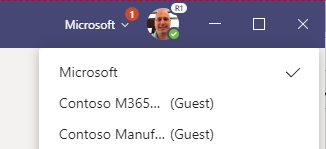

# Collaborate with a Remote Assist user via Microsoft Teams on PC

## Overview

When you use Teams on a PC running Windows 10, you can collaborate with people using Remote Assist on HoloLens 1 or 2 (a “Remote Assist HoloLens user”) or Remote Assist on a mobile device (a “Remote Assist mobile user”).   
However, the features you can use to collaborate differ depending on which platform the Remote Assist user is using.  

### Feature comparison: Collaborating with Remote Assist HoloLens user versus Remote Assist mobile user

|  |Teams desktop features available when collaborating with Remote Assist HoloLens user|Teams desktop features available when collaborating with Remote Assist mobile user|
|---|---|---|
|Teams desktop features available when collaborating with Remote Assist HoloLens user                 |Teams desktop features available when collaborating with Remote Assist mobile user                   |
|Yes                                                                                                  |Yes, but Remote Assist mobile user must have Remote Assist app open to be notified of the call       |
|Yes                                                                                                  |Yes                                                                                                  |
|Yes                                                                                                  |Yes                                                                                                  |
|Yes                                                                                                  |No; Remote Assist mobile does not support group calls                                                |
|Yes                                                                                                  |No; Remote Assist mobile does not support meetings                                                   |
|Yes                                                                                                  |Yes                                                                                                  |
|No                                                                                                   |Yes                                                                                                  |
|Yes                                                                                                  |Yes                                                                                                  |
|Yes                                                                                                  |No; However, Remote Assist mobile file support will be available April 2020                          |
|Yes, only in a group call, meeting, or one-to-one call initiated using the Meet Now feature.         |No;                                                                                                  |
|However, starting in April 2020, the Remote Assist HoloLens user can record a normal one-to-one call.|However, starting in April 2020, the Remote Assist HoloLens user can record a normal one-to-one call.|
|Yes                                                                                                  |No                                                                                                   |

### Key terms

When you join a call, you will see the **Mixed Reality Toolbar.**

And the **call controls panel.**

 
The More Options panel  includes additional features. 

A **meeting** is a call scheduled using Teams. A meeting can include 1+ more participants.
A **1:1 call** is an ad hoc call that is not scheduled using Teams.  
A **group call** is an ad hoc call that is not scheduled using Teams. To create a group call, start with a 1:1 call and then add more participants. 

## Launch Teams 

Launch the Teams app.

    > [!IMPORTANT]
    > If this is the first time the expert has launched [!include[pn-teams](../includes/pn-teams.md)] and the expert has not been invited to any other teams, [!include[pn-teams](../includes/pn-teams.md)] will automatically take the expert to the correct place. If the expert has been invited to other teams, the expert might need to switch to the appropriate tenant.  
    >     
    > To switch tenants, in the drop-down menu in the upper-right corner of the window, select the appropriate guest tenant:
    
    
       
    > [!NOTE]
    > [!include[pn-teams](../includes/pn-teams.md)] might take a few seconds to reload.
    

## Make and take calls

### Accept a call  
When you see an incoming call notification in the bottom right of your screen, select Audio or Video to join the call.

### Make a one-to-one call to Remote Assist user in your company	
After launching Teams, select the Calls tab on your left to see suggested contacts. Select the Video icon on the contact card to call a suggested contact, of use the search bar to find a contact and call them. 

>![Note]
> Teams desktop users are not able to record a one-to-one call (i.e. an outgoing or incoming ad hoc call). To record a one-to-one call with a contact in your company or outside your company, a Teams desktop user must initiate the call using the Meet Now feature. (The Meet Now feature is not available for Teams mobile users.) Learn more about the [Meet Now feature](https://github.com/MicrosoftDocs/dynamics-365-mixed-reality-pr/blob/toc-sandbox/mr-docs/remote-assist/teams-pc-all.md#make-and-record-a-one-to-one-call-with-a-remote-assist-hololens-user-using-the-meet-now-feature).

### Make a one-to-one call to Remote Assist user outside your company	

You can make or receive a one-to-one call with a Remote Assist user from another company if external access for both companies has been enabled in Microsoft Teams. If you're the admin for your organization, to set up external access, see Set up cross-company calling. When searching for the external user, you must enter the full email address of the external user. 

>![Note]
> If you're not able to find the contact you're looking for, it might be because external access has not been enabled in Microsoft Teams for your company or the other company. Contact your administrator for help.  

### Make a group call (with Remote Assist HoloLens user only)

A group call can include up to 1 Remote Assist HoloLens user and 49 Teams Desktop users. 
Start by calling one person, and then select Open Participants  button. Then, search the person you would like to call and call them.

### Make and record a one-to-one call with a Remote Assist HoloLens user using the Meet Now feature 

You may want to record the Remote Assist call for documentation or record-keeping purposes. There are three ways to record a call. Learn about the different types of calls [here](insert link to “record a call”). 
Teams desktop only supports recording group calls and meetings (regardless of how many call participants are in the meeting). In other words, when you are in a call, a Teams desktop user can use Teams to initiate a cloud-based recording only if the call is a group call or a meeting. (At this time, a HoloLens user cannot record the call.) 
So how do you record a one-to-one call? You will need to make your one-to-one call a meeting. In other words, if you anticipate wanting to use Teams to create a cloud-based recording of a one-to-one call with a Remote Assist HoloLens user, the easiest way to do this is to initiate your call using the Teams **Meet Now** feature. (This effectively makes your ad hoc one-to-one call a meeting, and because Teams supports recording for meetings, you will be able record the call!)

1.	Navigate to the Calendar tab. On the top right corner of the page, you will see. Click **Meet Now.**

2. Name the meeting and select **Join now**
3. Invite people to the meeting using the “Invite someone or dial a number” field on the right half of the screen. Click the […] and click start recording. 
4. When the call ends, it will appear as a normal Meeting in your Teams chat log. The chat log will include everyone was invited to the meeting. Stream processes the recording.
5. The person who initiates the recording is the recorder and owns the video. When a recording ends, it begins being uploaded to Microsoft Stream. Once the video is uploaded to Stream, the recorder receives an email notification, and all call participants can view a link to Stream via the Teams chat. The owner is the only participant who can [give permission](https://support.office.com/en-us/article/Play-and-share-a-meeting-recording-in-Teams-7d7e5dc5-9ae4-4b94-8589-27496037e8fa#bkmk_sharemeetingrecording) or [download the video](https://support.office.com/en-us/article/Play-and-share-a-meeting-recording-in-Teams-7d7e5dc5-9ae4-4b94-8589-27496037e8fa#bkmk_downloadmeetingrecording) to share the recording beyond these people. [Learn more about Stream video permissions.]( https://docs.microsoft.com/en-us/stream/portal-permissions)

You can find all the videos you own [here]( https://msit.microsoftstream.com/studio/videos).

If your admin has configured Field Service integration, you can access the recording link and can post it in a D365 Field Service booking.

## Schedule and join a meeting (with a Remote Assist HoloLens user only)

### Schedule a meeting ahead of the call (with Remote Assist HoloLens user only)

Read about how to [join a Teams meeting here](https://support.office.com/en-us/article/Schedule-a-meeting-in-Teams-943507a9-8583-4c58-b5d2-8ec8265e04e5#ID0EAABAAA=Desktop), or [watch a tutorial video](https://support.office.com/en-us/article/Video-Manage-meetings-ba44d0fd-da3c-4541-a3eb-a868f5e2b137).

### Join a Teams Meeting (with Remote Assist HoloLens user only)

Read about how to [schedule a meeting here](https://support.office.com/en-us/article/join-a-meeting-in-teams-1613bb53-f3fa-431e-85a9-d6a91e3468c9), or [watch a tutorial video](https://support.office.com/en-us/article/join-a-teams-meeting-078e9868-f1aa-4414-8bb9-ee88e9236ee4?ui=en-US&rs=en-US&ad=US).

If the Remote Assist user has been invited to the meeting, they can log into Remote Assist and select “Join Meeting” at the bottom of the Recent Contacts page.

If a Remote Assist user was not invited to the meeting, but you would like them to join the meeting: join the meeting, then select Participants panel   from Call controls, start typing their name in this field  , and call them. 

## Adjust what you see

Teams tries to anticipate what you’ll want to see in a meeting, but you can [pin a video, reframe a video, and more.]( https://support.office.com/en-us/article/adjust-your-view-in-a-teams-meeting-9825091c-0e7d-4c2b-95f5-eba644f19175).

>![Note]
> At this time, when you use Teams to capture a cloud-based recording of the call, Teams does not preserve the view you configure. The layout of the recording is determined by the number of call participants. See two examples below.

|Teams recoding of call with 2 participants |Teams recording of call with 4+ participants | 
|--|--|
|| |

If you want the recording to capture the exact layout of the call you configure, use the [Windows Gamebar](ADD LINK) to capture a screen recording of your computer.

To learn more about the different options for recording a call or portion of a call, read this [comparison chart](ADD LINK).

## Use call controls

When you are in a call, call controls are found at the bottom of the screen. 
-	 Toggle the video icon to control outgoing video
-	 Toggle the microphone to control outgoing audio
-  Select the Share button to share your desktop or a running application (with a Remote Assist HoloLens user only) 
-	 Select the text chat to send text messages (and share files with a Remote Assist HoloLens user only)
-	 Select the participants icon to view and add participants to the call

To use additional features, select the […]. For example, select ‘Blur my background” if you have sensitive information behind you or want to protect the privacy of colleagues who are behind you. When you are in a group call or meeting, the More Options […] panel will also provide the option to record the call.  

## Work with annotations  

When in a call, you will see your collaborator’s space—including the holograms—and can use the **Mixed Reality toolbar** to add holograms.

## Draw and annotate

### Begin editing 

To start annotating a contact’s space, first do one of the following to pause
the video stream and enter edit mode:

-   Select anywhere in the call window.

-   Select one of the items on the Mixed Reality toolbar.

-   Select **Start editing**.

>![Note]
> By default, the Mixed Reality toolbar is on the top of your screen. If it is blocking your view and you'd like to move it somewhere else, select  and drag the Mixed Reality toolbar where you would like it to be.

In edit mode, the expert will still see a live stream of the call in the corner of the app window, including the annotations that other call participants add.

### Add arrows, ink, and files

Use the Mixed Reality toolbar to place arrows, draw, or add files:

-   To add arrows, select **Place arrow**  .

-   To add ink, select **Ink**  .

-   To change the arrow or ink color, select **Pick a color**  .

-  •	To add a file when in a call with a Remote Assist HoloLens user, select  **Insert files** , and then add an image file or a PDF file from OneDrive or from your device. More details [here](teams-pc.md/#share-files). 

### Finish editing

When done annotating, do one of the following to finish editing and return to
live mode:

-   Select **Stop editing**.

-   Select the live video feed in the corner of your screen.

### Make changes to edits

To make changes to edits, do one of the following:

-   While in edit mode, select **Undo** to undo the last action.

-   While in edit mode, select **Erase all**  to erase all of the annotations made during that editing session.

-   While in live mode, select **Erase all**  to erase all of the annotations made during that call.

> [!NOTE]
> * Specific drawings or arrows can’t be removed.
> *	Each call participant can only remove the annotations they added 

## Share files (with a Remote Assist HoloLens user only)

There are two ways to share a OneDrive file or local file with a Remote Assist HoloLens user. Supported files include .jpg, bmp, png, tif, pdf, and still gif.  

* From the mixed reality tool bar, select the Share File feature to share a file from OneDrive or your computer. The file will be uploaded in your personal OneDrive and permissions to access to that single file will be granted to call participants. 
*	From the Teams chat, select Attach file to share a file from OneDrive or your computer. 

When you share a file, it will pop up as a new slate in the Remote Assist HoloLens user’s space and a link to the file will be shared in the chat. All call participants can annotate a file displayed in the Remote Assist HoloLens user’s space.

> ![Note]
After adding them, files can’t be moved, deleted, or resized by the Teams user.

Accessing the file after the call: 
*	Any call participant can find the link to the file in the Teams chat. 
*	During the call, the Remote Assist HoloLens user can save the file to their OneDrive for future reference by tapping the OneDrive icon in the top right corner of the slate. The file is then automatically saved to a OneDrive folder called “HoloLens Received Files.”  

## Share your desktop or a running application (with a Remote Assist HoloLens user only)

You may want to share your desktop or running application with a Remote Assist user. For example, this is useful if you'd like to communicae information that's not captured in a document that you can share with the Remote Assist user. 

To share your desktop or a running application:

1. In [!include[pn-teams](../includes/pn-teams.md)], select the **Open share tray** button.

   
   
2. Select the screen you want to share.

> [!NOTE]
> You can only share one application or screen at a time. If you want to share a different screen, select the **Close share tray** button to stop sharing, select a different screen, and then start sharing again.

## Record the call

You may want to record the Remote Assist call for documentation or record-keeping purposes. There are three ways to record a call. The method you use depends on the type of call that you are in (1:1, group, or meeting) and other factors.

**Method 1: Cloud-based recording for group calls and meetings using Teams**

Teams desktop only supports recording group calls and meetings (regardless of how many call participants are in the meeting). In other words, when you are in a call, a Teams desktop user can use Teams to initiate a cloud-based recording only if the call is a group call or a meeting. (At this time, a HoloLens user cannot record the call.) 

See more pros and cons in the [chart below](teams.md/#Comparison-chart-3-ways-to-record-a-call), and see additional details here.

**Method 2: Cloud-based recording for one-to-one calls using Teams Meet Now feature** 

So how do you record a one-to-one call? You will need to make your one-to-one call a meeting. In other words, if you anticipate wanting to use Teams to create a cloud-based recording of a one-to-one call with a Remote Assist HoloLens user, the easiest way to do this is to [initiate your call using the Teams **Meet Now** feature](https://github.com/MicrosoftDocs/dynamics-365-mixed-reality-pr/blob/toc-sandbox/mr-docs/remote-assist/teams-pc-all.md#make-and-record-a-one-to-one-call-with-a-remote-assist-hololens-user-using-the-meet-now-feature). (This effectively makes your ad hoc one-to-one call a meeting, and because Teams supports recording for meetings, you will be able record the call!)

See more pros and cons in the chart below, and see additional details here.

**Method 3: Desktop screen recording using Windows Gamebar**

However, Teams cloud-based recording has limitations. The recording captures the outgoing video feed (or avatar) of up to 4 call participants and the recording screen is divided evenly among the call participants. This means that if even if primarily care about what the HoloLens user sees, you cannot adjust the Teams recording layout to only capture what the HoloLens user sees. This may be particularly confusing for a call with two participants; **during the call**, you will see a **horizonal** section of the HoloLens user’s view, but because the Teams recording divides the recording screen into half, **in the call recording**, you will see a **vertical section** of the HoloLens user’s view.

See more pros and cons in the chart below, and see additional details here (teams-pc.md/Cloud-based recording of group calls and meetings using Teams).

**The HoloLens user can also record only the HoloLens view**

See pros and cons in the chart below, and see additional details here (link to mobile doc).

## Comparison chart: 3 ways to record a call 

The chart below compares different ways of recording the call. It also includes details for only recording the HoloLens view.

| Recording type | What the recording captures|Pros |Cons |
|--|--|--|--|
|[Cloud-based recording of group calls and meetings] (teams-pc.md/Cloud-based recording of group calls and meetings using Teams)|[Cloud-based recording of group calls and meetings] (teams-pc.md/Cloud-based recording of group calls and meetings using Teams)|Recording is automatically saved in Stream and link is available in Teams chat. If your admin has configured Field Service integration, you can access the recording link and can post it in a D365 Field Service booking.|Recording layout is not configurable.|
|[Cloud-based recording of one-to-one calls](addLink)|Teams desktop outgoing video feed (or avatar), and middle vertical section of HoloLens outgoing video feed  |Recording is automatically saved in Stream and link is available in Teams chat. If your admin has configured Field Service integration, you can access the recording link and can post it in a D365 Field Service booking.|Recording layout is not configurable. Holograms and real world objects that are in the right or left periphery of the HoloLens user’s view will not be captured in the recording.|
|Desktop screen recording [add link to section below]|The Teams layout the recorder sees and [configures]( https://support.office.com/en-us/article/adjust-your-view-in-a-teams-meeting-9825091c-0e7d-4c2b-95f5-eba644f19175) during the call. |Because the Teams desktop user is just recording their computer screen, the recording layout matches what Teams desktop user sees during the call.|If the recording needs to be accessible to others, the Teams user must manually upload the video to a shared drive|
|HoloLens view recording[add link to section below]|HoloLens user’s view |Clarity of HoloLens user’s field of view is not impacted by call connection quality.|If the recording needs to be accessible to others, the HoloLens user must manually upload the video to a shared location. Recording length may be limited by HoloLens internal memory.|

## Cloud-based recording of group calls and meetings using Teams

**What does this type of recording capture?**

Cloud-based recording of group calls and meetings captures the outgoing video feed (or avatar) of up to 4 call participants. 
Benefits of cloud-based recording: Recording is automatically saved online and accessible to all call participants
The person who initiates the recording is the recorder and owns the video. When a recording ends, it begins being uploaded to Microsoft Stream. Once the video is uploaded to Stream, the recorder receives an email notification, and all call participants can view a link to Stream via the Teams chat. The owner is the only participant who can [give permission]( https://support.office.com/en-us/article/Play-and-share-a-meeting-recording-in-Teams-7d7e5dc5-9ae4-4b94-8589-27496037e8fa#bkmk_sharemeetingrecording) or [download the video]( https://support.office.com/en-us/article/Play-and-share-a-meeting-recording-in-Teams-7d7e5dc5-9ae4-4b94-8589-27496037e8fa#bkmk_downloadmeetingrecording) to share the recording beyond these people. [Learn more about Stream video permissions.]( https://docs.microsoft.com/en-us/stream/portal-permissions)

You can find all the videos you own [here.]( https://msit.microsoftstream.com/studio/videos).

If your admin has configured Field Service integration, you can access the recording link and can post it in a D365 Field Service booking.

**Limitations of cloud-based recording: recording layout is not configurable**

The layout of the Teams recording depends on the number of call participants, and the layout cannot be configured. When using Teams to record the call, the Remote Assist HoloLens user’s never occupies the entire recording. 

>![Note]
>If it is imperative that your recording only captures as much of the Remote Assist HoloLens user’s view as possible, and as little of Teams user’s outgoing videos (or avatars), consider recording your desktop screen using Windows Gamebar [AddLink]. 

**Teams recording with 2 participants**

In a Teams meeting recording with two participants, each participant’s outgoing video (or avatar) occupies one half of the recording, and both halves are vertical. This means that during a Remote Assist call, a Teams desktop user sees a horizonal slice of what you see, but the recording only captures the middle vertical slice of what you see. Furthermore, during the Remote Assist call, the Teams user only sees their outgoing video feed in the corner of the call, but in the recording, their outgoing video feed occupies half the recording. (If the Teams user turns off their outgoing video feed, their avatar will occupy half the recording.)

**Teams recording with 3 participants**

In a Teams recording with three participants, each participant’s outgoing video (or avatar) occupies one third of the recording. Furthermore, during the Remote Assist call, the Teams user only sees their outgoing video feed in the corner of the call, but in the recording, their outgoing video feed occupies one third the recording. (If the Teams user turns off their outgoing video feed, their avatar will occupy one third of the recording.)

**Teams recording with 4 participants**

In a Teams recording with four or more participants, each participant’s outgoing video (or avatar) occupies one fourth of the recording. During the Remote Assist call, the Teams user only sees their outgoing video feed in the corner of the call, but in the recording, their outgoing video feed occupies one fourth of the recording. (If the Teams user turns off their outgoing video feed, their avatar will occupy one fourth of the recording.) 

**Teams recording with 4+ participants**

A Teams recording including four or more participants splits the horizonal recording into four, with remaining participants’ avatars in the bottom right corner of the recording. 

**How to initiate a recording**
If you are in a group call or meeting, navigate to the call controls. Select More Options, then select Start recording. A call recording ends if:
*	You select **Stop recording**
*	Remote Assist call ends

## Cloud-based recording of one-to-one calls using Teams Meet Now

Cloud-based recording of one-to-one calls initiated via Teams Meet Now is very similar to Cloud-based recording of group calls or meetings. The only difference is how a Teams desktop user initiates the recording. 

**How to initiate a recording**
See [Initiate and record a one-to-one call with a Remote Assist HoloLens user using the Meet Now feature](AddLink)

>![Note]
>If, after reviewing the alternative methods below, you decide that this method best fits your requirements, remember that the recording only captures the middle section of the HoloLens users view. This means that for the tasks that the Remote Assist user and expert really want recorded, the Remote Assist user should try to keep those tasks in the center of the HoloLens user’s view.   

## Desktop screen recording using Windows Gamebar

**What does this type of recording capture?**
The Teams layout that the call recorder [configures]( https://support.office.com/en-us/article/adjust-your-view-in-a-teams-meeting-9825091c-0e7d-4c2b-95f5-eba644f19175) during the call.

**Benefits of cloud-based recording:**
Because the Teams desktop user is just recording their computer screen, the recording layout matches exactly what Teams desktop user sees during the call.

**Limitations of cloud-based recording:**
If the recording needs to be accessible to others, the Teams user must manually upload the video to a shared drive and share it with all call participants or additional people.

**How to initiate a recording**
1. On a [!include[pn-ms-windows-short](../includes/pn-ms-windows-short.md)] 10 desktop PC, join a call using [!include[pn-microsoft-teams](../includes/pn-microsoft-teams.md)].

2. Press **Windows logo key  + G** to open the Game bar.

   

3. Select the **Start Recording** button (or press **Windows logo key  + Alt + R**).

   A small recording menu will appear that shows that the recording is in progress.
   
   
   
4. To stop recording, select the **Stop Recording** button.

   The video of the recording will appear in your **Videos/Captures** folder.
   
[Learn more about the Game bar.](https://support.xbox.com/xbox-on-windows/social/record-game-clips-game-bar-windows-10)

## Send a text message 

During a call, participants can communicate through the text chat. The chat log will be available via Teams after the call ends.

From the call controls, select Text Chat   to open the chat. Note that the Remote Assist user can only see messages exchanged during the call, but you may see messages exchanged before the call. 

You can also attach a OneDrive file or local file via the Teams chat **Attach file** feature.

>![Note]
>Remote Assist chat supports certain formats, including bold, italic, strikethrough, and underline. It also supports hyperlink. However, it does not support html-formatted or lists, such as a passage you copy and paste from a website. 
For example, if you copy and paste text from a website that has HTML formatting and send it during a Remote Assist call, the Remote Assist HoloLens user will see the text in the Remote Assist chat window, but the formatting may not be what you expect.

## File a support ticket
If you encounter an issue that is blocking you from using the application, [file a support ticket](https://support.microsoft.com/en-us/hub/4338666/hololens-help). Support will work directly with you until the issue is resolved.

