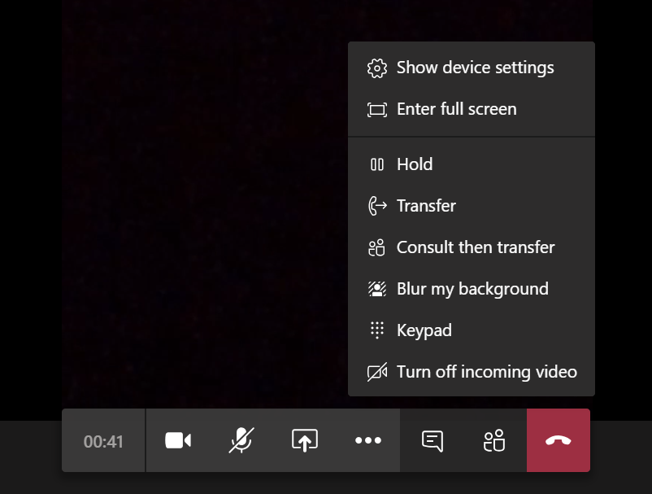
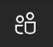
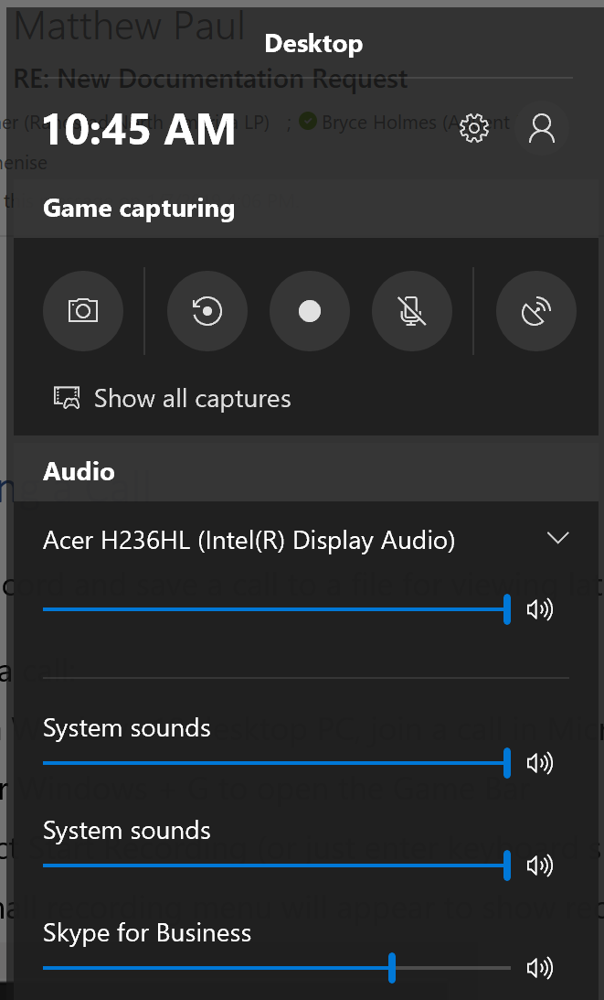
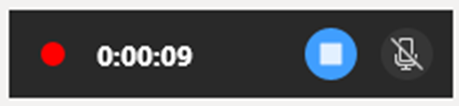

# Collaborate with a Dynamics 365 Remote Assist user through the Microsoft Teams desktop application

When you use the Teams desktop application on a PC running Windows 10, you can collaborate with people using Dynamics 365 Remote Assist on HoloLens or HoloLens 2 (in this article, a "Dynamics 365 Remote Assist HoloLens user") or Dynamics 365 Remote Assist on a mobile device (in this article, a "Dynamics 365 Remote Assist mobile user").  

However, the features you can use to collaborate differ depending on which platform the Dynamics 365 Remote Assist user is using.  

## Collaborating with Dynamics 365 Remote Assist HoloLens user versus Dynamics 365 Remote Assist mobile user
|                                                                                                |Teams desktop features available when collaborating with Dynamics 365 Remote Assist HoloLens user                 |Teams desktop features available when collaborating with Dynamics 365 Remote Assist mobile user                   |
|-----------------------------------------------------------------------------------------------------|-----------------------------------------------------------------------------------------------------|-----------------------------------------------------------------------------------------------------|
|                                                                                                     |                                                                                                     |                                                                                                     |
|Make outgoing call                                                                                   |Yes                                                                                                  |Yes      |
|Receive incoming call                                                                                |Yes                                                                                                  |Yes                                                                                                  |
|Join a one-to-one call                                                                               |Yes                                                                                                  |Yes                                                                                                  |
|Join a group call                                                                                    |Yes                                                                                                  |Yes                                               |
|Join a meeting                                                                                       |Yes                                                                                                  |No; Remote Assist mobile does not support meetings.                                                  |
|Control outgoing video, outgoing audio, and incoming audio                                           |Yes                                                                                                  |Yes                                                                                                  |
|Annotate Dynamics 365 Remote Assist user's environment                                                            |Yes                                                                                                    |Yes                                                                                                  |
|Annotate 2D snapshot using arrows and ink                                                            |No                                                                                                   |Yes                                                                                                  |
|Send a text message                                                                                  |Yes                                                                                                  |Yes                                                                                                  |
|Share files from OneDrive or device                                                                  |Yes                                                                                                  |Yes  |
|Record call                                                                                          |Yes, only in a group call or meeting. A one-to-one call can be recorded, but the Remote Assist HoloLens user must initiate the recording.      |A one-to-one call can be recorded, but the Remote Assist mobile user must initiate the recording.                  |
|Share screen                                                                                         |Yes                                                                                                  |No, but you can send any file type to a Remote Assist mobile user.                                                                                                    |                               

## Key terms

When you join a call, you'll see the Mixed Reality toolbar, seen in the following screenshot.

You'll also see the **Call Controls panel**, seen in the following screenshot.

 
The **More Options** panel includes additional features. 

 

- A **meeting** is a call scheduled using Teams. A meeting can include one or more participants.
- A **one-to-one call** is a call between two people that is not scheduled using Teams.  
- A **group call** is a call with more than two people that is not scheduled using Teams. To create a group call, start with a one-to-one call and then add more participants. 

## Launch Teams 

Launch the Teams app.

> [!IMPORTANT]
> If this is the first time you have launched Teams and you have not been invited to any other teams, Teams will automatically take you to the correct place. If you have been invited to other teams, you might need to switch to the appropriate tenant.  
>     
> To switch tenants, in the drop-down menu in the upper-right corner of the window, select the appropriate guest tenant. Teams might take a few seconds to reload.
 
## Make and take calls

### Accept a call  
When you see an incoming call notification in the bottom right of your screen, select **Audio** or **Video** to join the call.

### Call a Dynamics 365 Remote Assist user who is in your tenant	
After launching Teams, select the **Calls** tab on your left to see suggested contacts. Select the **Video** icon on the contact card to call a suggested contact, or use the search bar to find a contact and call them. 

>[!Note]
> Starting in the April 2020 release, Dynamics 365 Remote Assist users (HoloLens and mobile) can initiate a cloud-based recording of a one-to-one call with one Teams desktop user. If you're not using the April 2020 release or later, you can only record a one-to-one call with a Remote Assist HoloLens user if you initiate the call using the **Teams Meet Now** feature. (The **Meet Now** feature is not available for Teams mobile users.) 
> 
> To initiate a call using the **Meet Now** feature:
> 
> 1. Go to the **Calendar** tab. 
> 
> 2. Select **Meet Now** in the top-right corner of the page. 
> 
> 3. Invite people to the meeting using the **Invite someone or dial a number** field on the right half of the screen. 
> 
> 4. Select the ellipses icon […], and then select **Start Recording**. 
 
### Call a Dynamics 365 Remote Assist user who is outside your tenant	

You can search, call, and receive a call from a Dynamics 365 Remote Assist user in another tenant if your tenant is federated with that tenant. When searching for this Dynamics 365 Remote Assist user, you must enter their full email address.

>[!Note]
> If you're not able to find the contact you're looking for, it might be because Teams federation ([Teams external access](/microsoftteams/manage-external-access)) has not been enabled. Contact your administrator for help.  

### Make a group call 

1. Start by calling one person, and then select **Open Participants** (). 

2. Search for the person you would like to call, and then call them.

[Learn more about who can join a group call](mobile-app/making-calls-on-remote-assist-mobile.md).

## Schedule and join a meeting (with a Dynamics 365 Remote Assist HoloLens user only)

### Schedule a meeting ahead of the call

Check out the following links:

- [Schedule a meeting](https://support.office.com/article/Schedule-a-meeting-in-Teams-943507a9-8583-4c58-b5d2-8ec8265e04e5#ID0EAABAAA=Desktop)

- [Watch a tutorial video](https://support.office.com/article/Video-Manage-meetings-ba44d0fd-da3c-4541-a3eb-a868f5e2b137)

### Join a Teams meeting

Check out the following links:

- [Join a Teams meeting](https://support.office.com/article/join-a-meeting-in-teams-1613bb53-f3fa-431e-85a9-d6a91e3468c9)

- [Watch a tutorial video](https://support.office.com/article/join-a-teams-meeting-078e9868-f1aa-4414-8bb9-ee88e9236ee4?ui=en-US&rs=en-US&ad=US)

If the Dynamics 365 Remote Assist HoloLens user has been invited to the meeting, they can sign in to Dynamics 365 Remote Assist and select **Join Meeting** at the bottom of the **Recent Contacts** page.

If a Dynamics 365 Remote Assist HoloLens user was not invited to the meeting, but you would like them to join the meeting: 

1. Join the meeting, and then select **Participants** from the call controls.

2. Start typing their name, and then call them. 

## Adjust what you see

Teams tries to anticipate what you’ll want to see in a meeting, and you can also manually [pin a video, reframe a video, and more]( https://support.office.com/article/adjust-your-view-in-a-teams-meeting-9825091c-0e7d-4c2b-95f5-eba644f19175).

>[!Note]
> At this time, when you use Teams to capture a cloud-based recording of the call, the layout you configure is not the layout captured in the call recording. The layout of the recording is determined by the number of call participants. See two examples below.

*Example of a Teams recording of a call with two participants:*

 

*Example of a Teams recording of a call with more than four participants:*

If you want the recording to capture the exact layout of the call you configure, [use the Windows Game Bar](#desktop-screen-recording-using-windows-game-bar) to capture a screen recording of your computer. 

## Use call controls

When you're in a call, you'll see the call controls at the bottom of the screen. 

|Button|Description|
|------------|----------------------------------------------|
|| Controls outgoing video|
| | Controls outgoing audio|
| | Shares your desktop or a running application (with a Dynamics 365 Remote Assist HoloLens user only)|
|	| Opens a chat window to send text messages| 
|	| See current participants, or add more|

To use additional features, select the ellipses icon […]. For example, select **Blur my background** if you have sensitive information behind you or want to protect the privacy of colleagues who are behind you. When you are in a group call or meeting with a Dynamics 365 Remote Assist HoloLens user, the **More Options** […] button will also provide the option to record the call.  

## Add annotations in the Dynamics 365 Remote Assist user's environment 

When you're in a call, you'll see your collaborator’s space, including holograms, and can use the Mixed Reality toolbar to add annotations.

> [!NOTE]
> -	The toolbar appears only when the video on stage is from the Dynamics 365 Remote Assist user.
> -	The toolbar will appear but will be disabled if the Dynamics 365 Remote Assist user is not ready to receive annotations and files (for example, the  user's outgoing video feed is disabled, the user temporarily lost tracking, or Dynamics 365 Remote Assist is not in the foreground because the user did the bloom gesture).
> -	The toolbar will not appear if the same Dynamics Remote Assist user joins the call from a mobile device and a PC at the same time, or from a HoloLens and a PC at the same time.

### Begin editing 

To start annotating, first do one of the following to pause the video stream and enter edit mode:

-   Select anywhere in the call window.

-   Select one of the items on the Mixed Reality toolbar.

-   Select **Start editing**.

In edit mode, the expert will still see a live stream of the call in the corner of the app window, including the annotations that other call participants add.

### Add arrows, ink, and files

Use the Mixed Reality toolbar to place arrows, draw, or add files in the HoloLens user's space:

- To add arrows, select **Place arrow** ().

- To add ink, select **Ink** ().

- To add a file in the HoloLens user's space, select  **Insert files** (), and then add an image file or a PDF from OneDrive or from your device. 

- To change the arrow or ink color, select **Pick a color** ().

### Finish editing

When done annotating, you can either:

-   Select **Stop editing**.

-   Select the live video feed in the corner of your screen.

### Make changes to your edits

To make changes to your edits, you can:

- While in edit mode, select **Undo** to undo the last action.

- While in edit mode, select **Erase all** () to erase all of the annotations made during that editing session.

- While in live mode, select **Erase all** () to erase all of the annotations made during that call.

> [!Note]
> - Specific drawings or arrows can’t be removed.
> 
> - Each call participant can only remove the annotations they added.

## Annotate a 2D snapshot

Dynamics 365 Remote Assist enables users to take 2D snapshots of their environment and mixed reality annotations, and annotate them during a call. Snapshots are critical in situations where a still image might be needed to carefully add annotations to it. These snapshots can be used for reference later or work validation. Snapshots can also be utilized in low-bandwidth situations.

When a Dynamics 365 Remote Assist user takes a snapshot, the video feed will freeze. They can then start editing to begin adding annotations. After both call participants are finished annotating the snapshot, the Dynamics 365 Remote Assist user can select the check mark to exit from annotation mode, and can choose to save the snapshot.

Annotations are displayed only during the snapshot session. When the Dynamics 365 Remote Assist user exits Snapshot mode, annotations from that snapshot session are removed. 

For more information, check out the following links:

- [Using snapshots](./mobile-app/annotate-snapshot.md)

- [Low-bandwidth situations on HoloLens](hololens-low-bandwidth.md)

- [Low-bandwidth situations with the mobile app](./mobile-app/low-bandwidth-mode.md)

## Share files  

You can share a OneDrive file or local file with a Dynamics 365 Remote Assist user. Supported files include .jpg, .bmp, .png, .tif/.tiff, .pdf, and still .gif.  

>[!Note] 
>You might want to show the Dynamics 365 Remote Assist HoloLens user a file that is not supported by the file-sharing feature. For example, you might want to show a video and control when it plays and pauses, or show a PowerPoint presentation and control which slide the Dynamics 365 Remote Assist HoloLens user can see. You can do this by sharing your desktop or application window. When you do this, a new slate appears in the Dynamics 365 Remote Assist HoloLens user's environment. 

**Share files with a Dynamics 365 Remote Assist HoloLens user**

Use one of the following methods to share files with a Dynamics 365 Remote Assist HoloLens user:

- In the Mixed Reality toolbar, select **Add file** to share a file from OneDrive or your computer. The file will be uploaded in your personal OneDrive and permissions to access that single file will be granted to call participants. 

- From the Teams chat, select **Attach file** to share a file from OneDrive or your computer. 

Once the file is shared, it will pop up as a new slate in the Dynamics 365 Remote Assist HoloLens user's space and a link to the file will be shared in the chat. All call participants can annotate a file displayed in the Dynamics 365 Remote Assist HoloLens user's space.

> [!Note]
> After you share a file and it appears in the Dynamics 365 Remote Assist HoloLens user's space, you cannot move, delete, or resize the file.

**Share files with a Dynamics 365 Remote Assist mobile user**

- From the Teams chat, select **Attach file** to share a file from OneDrive or your computer. When you share a file with a Dynamics 365 Remote Assist mobile user, it will be sent in the Dynamics 365 Remote Assist mobile text chat.

To access the file after the call: 

- Any call participant can find the link to the file in the Teams chat. 

- During the call, the Dynamics 365 Remote Assist HoloLens user can save the file to their OneDrive by tapping the OneDrive icon in the top-right corner of the slate. The file is then automatically saved to a OneDrive folder called **HoloLens Received Files**. 

## Share your desktop or application window (with a Dynamics 365 Remote Assist HoloLens user only)

You may want to share your desktop or application window with a Dynamics 365 Remote Assist HoloLens user. This is useful if you'd like to communicate information that's not captured in a file type that is supported by the file sharing feature (.jpg, .bmp, .png, .tif/.tiff, .pdf, and still .gif.). For example, you may want to share an instructional video that is playing in your browser, or a series of instructions embedded in a PowerPoint presentation.  

To share your desktop or a running application:

1. Select the **Open share tray** icon.

   
   
2. Select the application window you would like to share, or share your screen. 

> [!Note]
> You can share one application window or screen at a time. If you want to share a different screen, select the **Close share tray** button to stop sharing, select a different screen, and then start sharing again.

## Record a call

You may want to record the Dynamics 365 Remote Assist call for documentation or record-keeping purposes. Read the following comparison chart to understand the three options for recording a call. Keep reading to learn more about each option. 

### Comparison chart: Three ways to record a call 

| Recording type | What the recording captures|Who initiates the recording?|Pros |Cons |
|--|--|--|--|--|
|Create a cloud-based recording using Teams or Dynamics 365 Remote Assist|Teams desktop outgoing video feed (or avatar) and Dynamics 365 Remote Assist outgoing video feed (or avatar)| A Teams desktop user can only initiate a cloud-based recording in a group call or meeting. A Dynamics 365 Remote Assist user (HoloLens or mobile) can only initiate a cloud-based recording in a one-to-one call with a Teams desktop user. | Recording is automatically saved in Microsoft Stream and link is available in Teams chat. If your admin has configured Field Service integration, you can post the recording link in a Field Service work order.| The layout of the recording depends on the number of call participants, and the layout cannot be configured. The recording captures the outgoing video feed (or avatar) of up to four call participants and the recording screen is divided evenly among the call participants. The Dynamics 365 Remote Assist HoloLens user’s view never occupies the entire recording, and even if you primarily care about what the HoloLens user sees, you cannot adjust the recording layout to only capture what the HoloLens user sees. This may be confusing for a call with two participants (for example, one-to-one call or meeting with two participants); **during the call**, you will see a **horizontal** section of the HoloLens user’s view, but because the Teams recording divides the recording screen into half, **in the call recording**, you will see a **vertical section** of the HoloLens user’s view.|
|Record your Teams desktop screen using Windows Game Bar|The exact call layout you [configure]( https://support.office.com/article/adjust-your-view-in-a-teams-meeting-9825091c-0e7d-4c2b-95f5-eba644f19175) during the call|Teams desktop user|Because the Teams desktop user is just recording their computer screen, the recording layout matches what Teams desktop user sees during the call.|If the recording needs to be accessible to others, the Teams user must manually upload the video to a shared drive and share it with all call participants or additional people.|
|Record the HoloLens user's view using HoloLens OS|HoloLens user’s view| HoloLens user |Clarity of HoloLens user’s field of view is not impacted by call connection quality.|If the recording needs to be accessible to others, the HoloLens user must manually upload the video to a shared location. Recording length may be limited by the HoloLens internal memory.|

### Create a cloud-based recording using Teams or Dynamics 365 Remote Assist

The comparison chart mentions that when you create a cloud-based recording using Teams, the recording screen is divided evenly among the call participants. Below are several examples.

#### Recording layout when call includes two participants

In a call recording with two participants, each participant’s outgoing video (or avatar) occupies one half of the recording, and both halves are vertical. This means that during a Dynamics 365 Remote Assist call, a Teams desktop user sees a horizontal slice of the HoloLens user's view, but the recording only captures the middle vertical slice of the HoloLens user's view. Furthermore, during the Dynamics 365 Remote Assist call, the Teams desktop user only sees their outgoing video feed in the corner of the call, but in the recording, the Teams desktop user's outgoing video feed occupies half the recording. (If the Teams user turns off their outgoing video feed, their avatar will occupy half the recording.)

>[!Note] 
> To ensure that critical information is captured in the recording, the HoloLens user must keep it in the center of their view. 

#### Recording layout when call includes three participants

In a recording with three participants, each participant’s outgoing video (or avatar) occupies one third of the recording. During the Dynamics 365 Remote Assist call, the Teams desktop user only sees their outgoing video feed in the corner of the call, but in the recording, the Teams desktop user's outgoing video feed occupies one third the recording. (If the Teams user turns off their outgoing video feed, their avatar will occupy one third of the recording.)

#### Recording layout when call includes four participants

In a recording with four participants, each participant’s outgoing video (or avatar) occupies one fourth of the recording. During the Dynamics 365 Remote Assist call, the Teams desktop user only sees their outgoing video feed in the corner of the call, but in the recording, the Teams desktop user's outgoing video feed occupies one fourth of the recording. (If the Teams user turns off their outgoing video feed, their avatar will occupy one fourth of the recording.) 

#### Recording layout when call includes four or more participants

A recording including four or more participants splits the horizontal recording into four, with remaining participants’ avatars in the bottom-right corner of the recording. 

#### How to initiate a cloud-based recording

If you're in a group call or meeting, go to the call controls, select **More Options,** and then select **Start recording.** A call recording ends if:

- You select **Stop recording**.

- The Dynamics 365 Remote Assist call ends.

If you're in a one-to-one call, ask the Dynamics 365 Remote Assist user (HoloLens or mobile) to initiate the recording.

The person who initiates the recording owns the video. When a recording ends, it begins uploading to Microsoft Stream. Once the video is uploaded to Stream, the recorder receives an email notification, and all call participants can view a link to Stream via the Teams chat. The owner is the only participant who can [give permission](https://support.office.com/article/Play-and-share-a-meeting-recording-in-Teams-7d7e5dc5-9ae4-4b94-8589-27496037e8fa#bkmk_sharemeetingrecording) or [download the video](https://support.office.com/article/Play-and-share-a-meeting-recording-in-Teams-7d7e5dc5-9ae4-4b94-8589-27496037e8fa#bkmk_downloadmeetingrecording) to share the recording beyond these people. [Learn more about Stream video permissions]( https://docs.microsoft.com/stream/portal-permissions).

You can [find all the videos you own](https://msit.microsoftstream.com/studio/videos).

If your admin has configured Field Service integration, you can access the recording link and can post it in a Dynamics 365 Field Service work order.

### Record your Teams desktop screen using Windows Game bar

If it is imperative that your recording only captures as much of the Dynamics 365 Remote Assist HoloLens user’s view as possible, and as little of the Teams user’s outgoing videos (or avatars), consider recording your desktop screen using the Windows Game Bar. 

#### Initiate a recording of what the Teams Desktop user sees during the call 

1. Join a Remote Assist call using the Teams desktop application.

2. Press the **Windows logo key** () + **G** to open the Game Bar.

   

3. Select the **Start Recording** button (or press **Windows logo key  + Alt + R**).

   A small recording menu will appear that shows that the recording is in progress.
   
   
   
4. To stop recording, select **Stop Recording**.

   The video of the recording will appear in your **Videos/Captures** folder.
   
[Learn more about the Windows Game bar](https://support.xbox.com/xbox-on-windows/social/record-game-clips-game-bar-windows-10).

### Record the HoloLens user's view using the HoloLens OS

[Learn about how the HoloLens user can use the HoloLens OS to record what they see](./record-calls-hololens.md#use-the-hololens-os-to-record-only-what-you-see-in-the-hololens-what-you-hear-around-you-and-what-you-hear-through-the-hololens-speakers). 

## Send a text message 

During a call, participants can communicate through the text chat. The chat log is available through Teams after the call ends.

From the call controls, select **Text Chat** ( to open the chat. The Dynamics 365 Remote Assist user can only see messages exchanged during the call, but you might see messages exchanged before the call. 

You can also attach a OneDrive or local file through the Teams chat **Attach file** feature.

>[!Note]
> Dynamics 365 Remote Assist chat supports certain formats, including bold, italic, strikethrough, and underline. It also supports hyperlinks. However, it does not support HTML-formatted or lists, such as a passage you copy and paste from a website. 
>
> For example, if you copy and paste text from a website that has HTML formatting and send it during a Dynamics 365 Remote Assist call, the Dynamics 365 Remote Assist HoloLens user will see the text in the Dynamics 365 Remote Assist chat window, but the formatting may not be what you expect.

## File a support ticket

If you encounter an issue that's blocking you from using the application, [file a support ticket](https://support.microsoft.com/hub/4338666/hololens-help). Microsoft support will work with you until the issue is resolved.

[!INCLUDE[footer-include](../includes/footer-banner.md)]