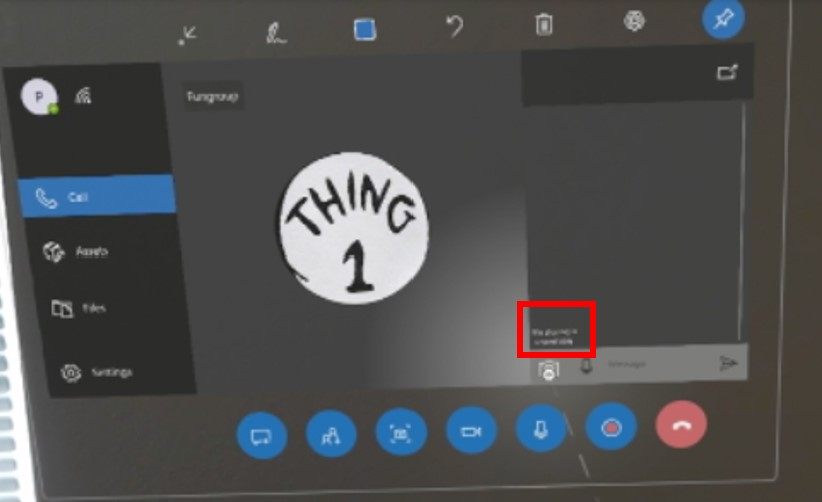
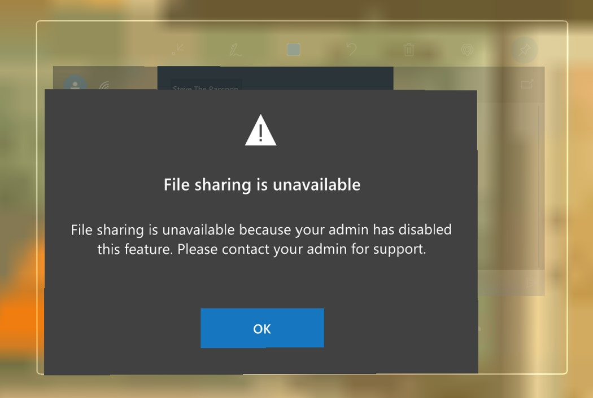
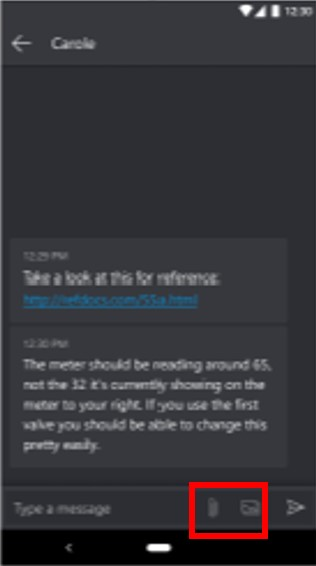
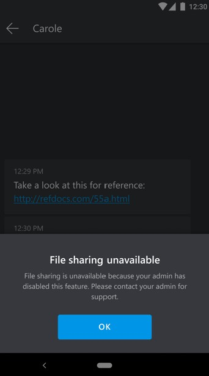

# Microsoft Teams policies supported by Dynamics 365 Remote Assist

Dynamics 365 Remote Assist supports the following Microsoft Teams policies: 

- Video
- Call recording
- Chat messaging
- File sharing
 
Users in your organization will automatically get the global policy unless you create and assign a custom policy. You can edit the settings in the global policy or 
create and assign one or more custom policies to turn the features that you want on or off.  

> [!NOTE]
> You can't set policies for specific applications (for example, Dynamics 365 Remote Assist vs. Teams).  

## Video policies

Video policies are used to control video stream capabilities. Video policies do not disable:

- The camera because the user can use [mixed reality capture (MRC)](/hololens/holographic-photos-and-videos)
- The low-bandwidth feature
- The asset capture feature 

> [!IMPORTANT]
> If video is disabled, users will not be able to see mixed-reality annotations from remote participants.  

### User experience in the HoloLens app

When video is disabled, the **Video** button is unavailable.

If the user selects the **Video** button, they see the following message that explains why outgoing video is unavailable.

### User experience in the mobile app

When video is disabled, the **Video** button is unavailable and the Mixed Reality toolbar is also unavailable.

If the user selects the **Video** button, they see the following message that explains why video is unavailable.

## Call-recording policies 

Call-recording policies are used to control call-recording capabilities. This allows admins to disable call recording for privacy purposes. If call recording is disabled through policy, the Dynamics 365 Remote Assist user will not be able to start a recording.  

> [!NOTE]
> This policy does not affect other participants on a call. Other participants will still be able to start/stop recordings.  

### User experience in the HoloLens app

When call recording is disabled, the **Recording** button is unavailable.

If the user selects the **Recording** button, they see the following message that explains why recording is not available.  
 

### User experience in the mobile app

When call recording is disabled, the **Start recording** command is unavailable.

If the user selects the **Start recording** command, they see the following message that explains why recording is not available.

## Chat-messaging policies

Chat-messaging policies are used to control which chat and channel messaging features are available to [users (owners and members)](/microsoftteams/assign-roles-permissions) in Microsoft Teams.  

If chat messaging is disabled, Dynamics 365 Remote Assist users can read but not send chat messages. Voice recording and photo capture are also disabled since these features require chat.  

### User experience in the HoloLens app

When chat messaging is disabled, the Chat window and keyboard are disabled and the user sees **Chat unavailable** in the Chat window.  

 
If the user tries to enter text in the Chat window, they see the following message that explains why chat is unavailable.

### User experience in the mobile app

When chat messaging is disabled, the Chat window and keyboard are disabled and the user sees **Chat disabled by admin** in the Chat window.

If the user tries to enter text in the Chat window, they see the following message explaining why chat is unavailable. 

## File-sharing policies

File-sharing policies are used to control whether a Dynamics 365 Remote Assist user or Microsoft Teams user can send files for a specific account. It doesn't affect whether they can receive files from other accounts. For example, you can disable the ability for a HoloLens user on a factory floor to send screenshots. If this same user logs into the Teams account that has file sharing disabled, the **Attach** button will be unavailable, so the user can't use Teams to send a file. 

### User experience in the HoloLens app

When file sharing is disabled, a message appears above the **Snapshot** button that indicates that file sharing is unavailable.

If the user selects the **Snapshot** button, they'll see another message that confirms that file sharing is unavailable.

### User experience in the mobile app

When file sharing is disabled, the file-sharing buttons are grayed out in the mobile app user interface.

The user will also see a message that says that file sharing is unavailable.

### Set up the policy (admins)

To set up the policy, you use the Microsoft Teams PowerShell Module. You can set up the policy for individual users or entire organizations. 

1. [Install the Microsoft Teams PowerShell Module](/microsoftteams/teams-powershell-install) if you haven't already. 

2. [Turn off file sharing for a specific account or organization](/microsoftteams/turn-off-teams-native-file-upload-policy#turn-off-nativefileentrypoints-for-specific-users). 
