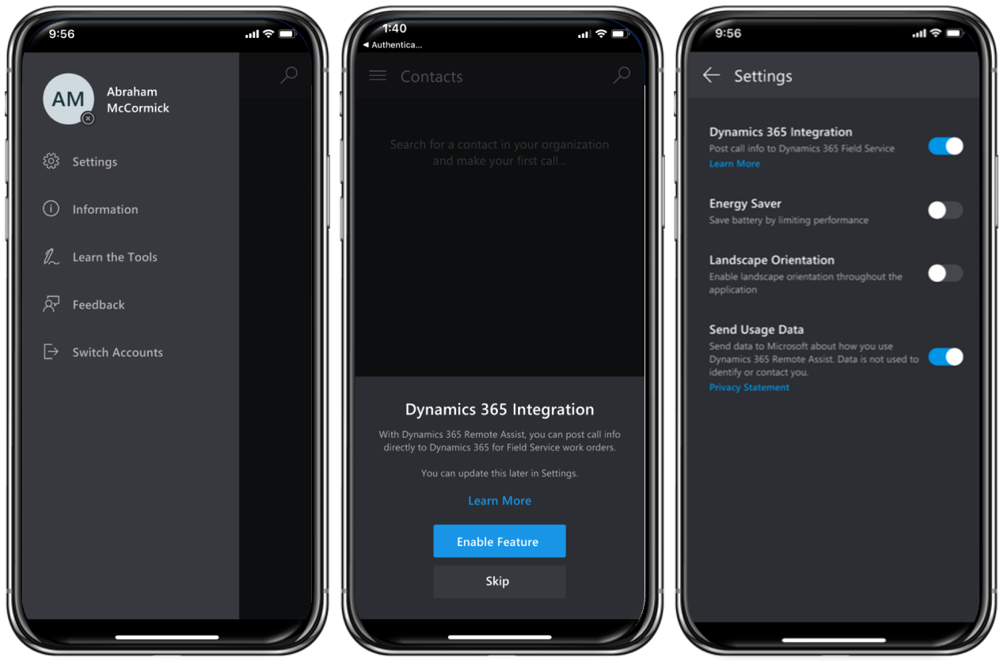
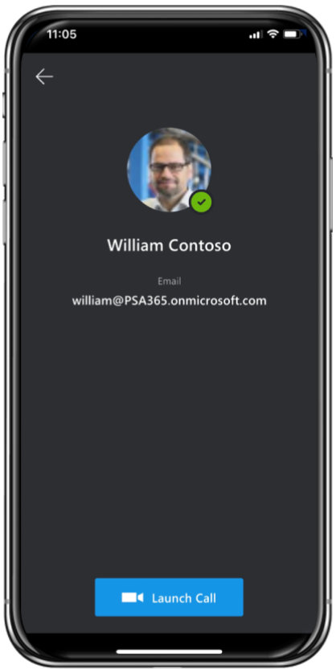
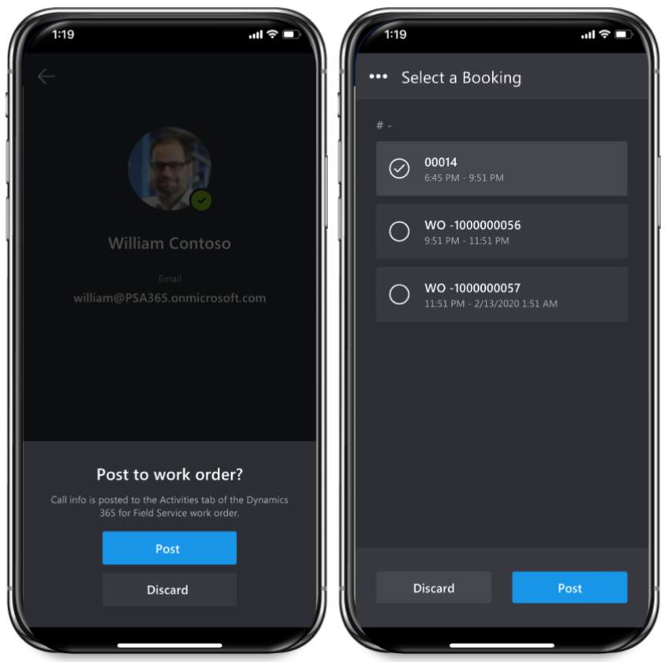

# Integrate Dynamics 365 Remote Assist with Field Service  

// use podcast for introduction: https://msit.microsoftstream.com/video/11b57eda-89d6-425b-bb97-3f41d8c6fac7

// Example to make better and improve upon:

- If your organization uses Dynamics 365 Field Service to manage Dynamics 365 Field Service work orders, the first-line worker using HoloLens can view Dynamics 365 Field Service bookings from Microsoft Dynamics 365 Remote Assist and quickly call the expert listed in the Support Contact field when needed. This enables first-line workers to do heads-up, hands-free calling through HoloLens in the context of a Dynamics 365 Field Service booking.

- deeplink
- see relevant work order information
- post call information to work order timeline

In this article we will explore how a field technician can use the Remote Assist Mobile app to make a call to an expert for help to complete a work order. This article will also explore the requirements to set up and use Remote Assist and Field Service together on the HoloLens.

## Prerequisites

Before you begin, make sure you have the following set up:

- A [!include[cc-microsoft](../includes/cc-microsoft.md)] [!include[pn-azure](../includes/pn-azure.md)] tenant with a [!include[pn-dyn-365](../includes/pn-dyn-365.md)] subscription **and** a [!include[pn-dyn-365-remote-assist](../includes/pn-dyn-365-remote-assist.md)] subscription. Both are required—[!include[pn-dyn-365-remote-assist](../includes/pn-dyn-365-remote-assist.md)] is not included in any [!include[pn-dyn-365](../includes/pn-dyn-365.md)] bundle.

  > [!NOTE]  
  > The tenant can have more than one [!include[pn-dyn-365](../includes/pn-dyn-365.md)] instance. [!include[pn-dyn-365-remote-assist](../includes/pn-dyn-365-remote-assist.md)] has the option to select an instance from within the app.

- You must have admin access to add or update the [!include[pn-dyn-365](../includes/pn-dyn-365.md)] tenant instance.
- The [!include[pn-dyn-365](../includes/pn-dyn-365.md)] instance must have the [!include[pn-dyn-365-field-service](../includes/pn-dyn-365-field-service.md)] app installed, and it must include the **My In Progress Bookings** view. To make sure this view is installed, we recommend [!include[pn-dyn-365-field-service](../includes/pn-dyn-365-field-service.md)] version 8.2 or later. This topic describes how to make sure you have the correct version and view.
- The tenant must have at least two user accounts.
- The user accounts must have the following licenses assigned:
  - [!include[pn-office-365](../includes/pn-office-365.md)] license that includes [!include[cc-microsoft](../includes/cc-microsoft.md)] [!include[pn-teams](../includes/pn-teams.md)]
  - [!include[pn-dyn-365-remote-assist](../includes/pn-dyn-365-remote-assist.md)]
  - A [!include[pn-dyn-365](../includes/pn-dyn-365.md)] license that includes [!include[pn-dyn-365-field-service](../includes/pn-dyn-365-field-service.md)]

## Set up technician user

 First create a bookable resource that will serve as the technician or front line worker that will use both Field Service on the Field Service Mobile app and Remote Assist on the Remote Assist Mobile app on his or her phone or tablet.

> [!div class="mx-imgBorder"]
> 

The bookable resource must have a **Resource Type = User** and the related user record will need licenses to use both Field Service Mobile and Remote Assist. To set up a field technician to use Field Service Mobile see the topic on [setting up Field Service users and secuirty roles](https://docs.microsoft.com/en-us/dynamics365/field-service/view-user-accounts-security-roles#set-up-a-field-technician-user).

Verify you can log into Field Service Mobile successfully with the field technician user.

> [!div class="mx-imgBorder"]
> 

Next, verify you can log into the Remote Assist mobile app with the same user. 

> [!Note]
> The Remote Assist mobile app is available on mobile devices running iOS and Android with the related ARkit or ARcore capabilities.

> [!div class="mx-imgBorder"]
> 

After signing in, ensure you enable the Dyanmics 365 integration. Select **Enable** from the popup or simply go to Settings.
   

## Set up expert user

As a different user that you have identified as an expert, verify you can sign in to Microsoft Teams. This user does not need a Field Service or Remote Assist license.
   
> [!div class="mx-imgBorder"]
> 

> [!Note]
> The expert must log in to the Microsoft Teams client app on his or her PC or mobile device. Teams on web is not supported.

## Create and schedule work orders

Next create a work order to outline the onsite work the technician or front line worker needs to perform, typically an installation or repair of an equipment or system. Enter a recommended expert in the **Support Contact** field that could be called via Remote Assist for support. Technicians will nto be limited to only calling this contact.

> [!div class="mx-imgBorder"]
> 

Then schedule the work order to the bookable resource that represents the technician also known as the front line worker who travels to customer locations to complete work orders. In our example, Abraham McCormick is the bookable resource and we scheduled work orders to him with Resource Scheduling Optimization.

> [!div class="mx-imgBorder"]
> 

## View work orders on Field Service Mobile

Just like any typical day, the technician logs in to Field Service Mobile and sees his or her assigned work orders for that day. If he or she feels they need the guidance of an expert who better knows the product, service, equipment, account that is being serviced, they can open the Remote Assist app from the work order.

> [!div class="mx-imgBorder"]
> 

> [!Note]
> The deep link from Field Service Mobile to Remote Assist Mobile is currently available on Android only. Technicians using iOS devices will maually open Remote Assist Mobile.

## Make a Remote Assist call

The Support contact will be auto selected to call if Remote Assist was opened via the deep link, otherwise the technician can search through the directory for Teams users inside or outside their organziation.

> [!div class="mx-imgBorder"]
> 

The "expert" will then receive the call like any other Teams call.

> [!div class="mx-imgBorder"]
> 

The technician can then begin to share what he or she sees through their mobile device's camera making annotations as needed.

> [!div class="mx-imgBorder"]
> 

From Teams the expert can make annotations as well. this makes it a shared mixed reality space between the technician (front line worker) and the expert.

## Post Remote Assist Call to work order

After gaining the necessary gudiance from the expert, the technician will end the call and be given the option to post the call as an activity to the work order time line.

Technicians can choose from a list of bookings they are scheduled for on the day of the call, which matches the Agenda view in Field Service Mobile.

> [!div class="mx-imgBorder"]
> 

Back on the work order, the dispacther can see a Remote Assist call took place.
> [!div class="mx-imgBorder"]
> 

Documeting the remote assist call on the work order is important because it lets managers know which types of issues are requiring extra help and can build training programs to accommodate.

## Set up and view Field Service bookings on HoloLens

If the technician is equipped with a HoloLens headset then viewing and interacting with Field Service is even better. 

Technicians can:

View today's bookings

> [!div class="mx-imgBorder"]
> 

View the work order and the recommended support contact field (expert)

> [!div class="mx-imgBorder"]
> 

Attach images during the Remote Assist call to the work order so future stakeholders can see the work or problem

> [!div class="mx-imgBorder"]
> 

Update booking statuses such as marking work as complete

> [!div class="mx-imgBorder"]
> 

### Set up Field Service for the HoloLens

1. Ensure you are using Field Service v8.2 or later. [Upgrade](https://docs.microsoft.com/en-us/dynamics365/field-service/upgrade-field-service#field-service) your solution if necessary. 
2. Confirm the **My In Progress Bookings** view on the Bookable Resource Booking entity is included

> Go to **Field Service** > **Settings** > **Customizations** > **Customize the System**.

> 
> [!Note]
> Fields can be added to this view if necessary for your business needs.

3. Create and schedule a work order as in previous steps

 > The booking will not appear in the Dynamics 365 pane in Dynamics 365 Remote Assist unless the booking status is **In progress** and the related bookable resource has a user record that matches the HoloLens user.
