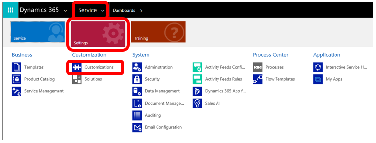
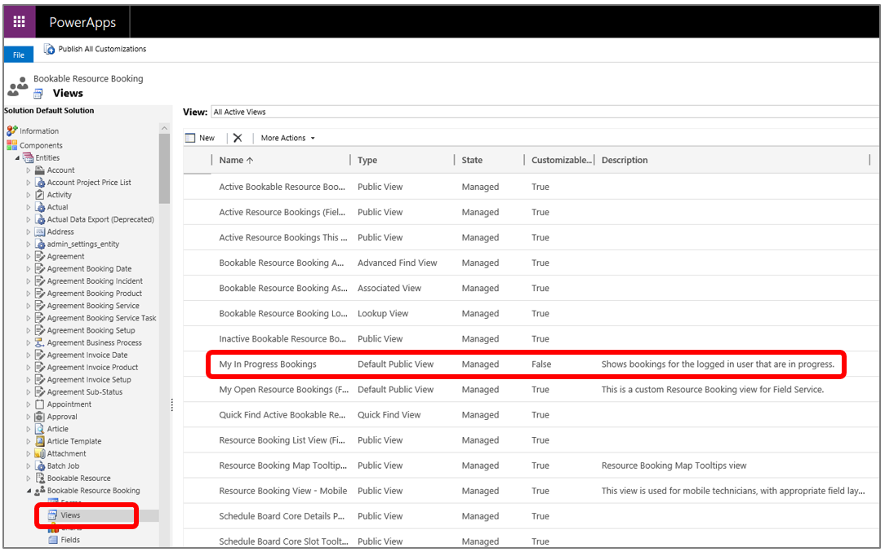
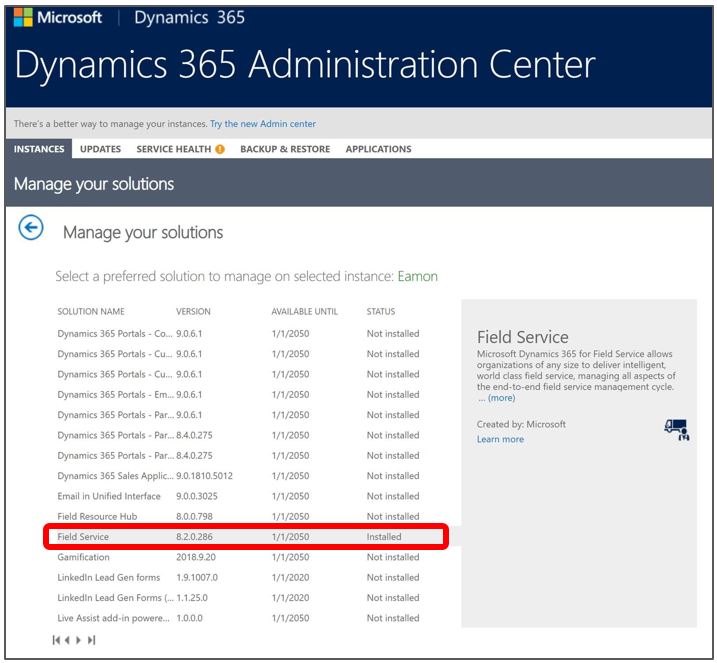
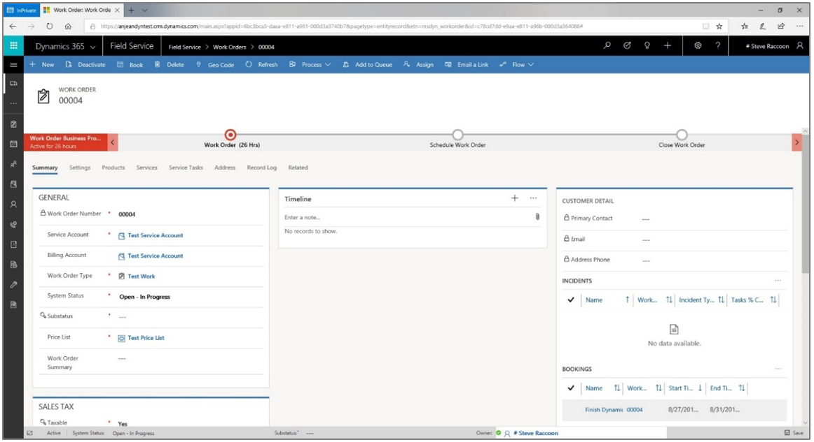
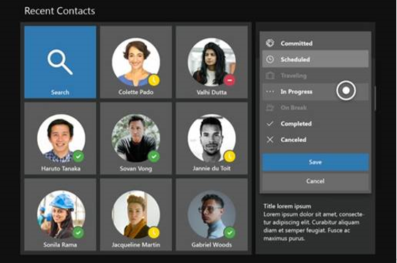

# Integrate Dynamics 365 Field Service with Dynamics 365 Remote Assist

If your organization uses [Dynamics 365 Field Service](https://dynamics.microsoft.com/field-service/overview/?&OCID=AID720979_SEM_yeaT05hp&lnkd=Bing_D365_Brand) to manage [!include[pn-dyn-365-field-service](../includes/pn-dyn-365-field-service.md)] work orders, 
the first-line worker using [!include[pn-hololens](../includes/pn-hololens.md)] can view [!include[pn-dyn-365-field-service](../includes/pn-dyn-365-field-service.md)] bookings from [!include[cc-microsoft](../includes/cc-microsoft.md)] [!include[pn-dyn-365-remote-assist](../includes/pn-dyn-365-remote-assist.md)] and 
quickly call the expert listed in the **Support Contact** field when needed. This enables first-line workers 
to do heads-up, hands-free calling through [!include[pn-hololens](../includes/pn-hololens.md)] in the context of a [!include[pn-dyn-365-field-service](../includes/pn-dyn-365-field-service.md)] booking.

This topic describes:

- Requirements for [!include[pn-dyn-365-field-service](../includes/pn-dyn-365-field-service.md)] integration
- How to make sure [!include[pn-dyn-365-field-service](../includes/pn-dyn-365-field-service.md)] is set up correctly 
- How to upgrade the [!include[pn-dyn-365](../includes/pn-dyn-365.md)] instance if you don’t have the correct [!include[pn-dyn-365-field-service](../includes/pn-dyn-365-field-service.md)] version
- How to add data for required fields in a [!include[pn-dyn-365-field-service](../includes/pn-dyn-365-field-service.md)] work order and booking
- How to customize the **[!include[pn-dyn-365](../includes/pn-dyn-365.md)]** pane that appears in [!include[pn-dyn-365-remote-assist](../includes/pn-dyn-365-remote-assist.md)]

## Requirements

Before you begin, make sure you have the following set up:

- A [!include[cc-microsoft](../includes/cc-microsoft.md)] [!include[pn-azure](../includes/pn-azure.md)] tenant with a [!include[pn-dyn-365](../includes/pn-dyn-365.md)] subscription **and** a [!include[pn-dyn-365-remote-assist](../includes/pn-dyn-365-remote-assist.md)] subscription. Both are required—[!include[pn-dyn-365-remote-assist](../includes/pn-dyn-365-remote-assist.md)] is not included in any [!include[pn-dyn-365](../includes/pn-dyn-365.md)] bundle.

  > [!NOTE]  
  > The tenant can have more than one [!include[pn-dyn-365](../includes/pn-dyn-365.md)] instance. [!include[pn-dyn-365-remote-assist](../includes/pn-dyn-365-remote-assist.md)] has the option to select an instance from within the app.

- You must have admin access to add or update the [!include[pn-dyn-365](../includes/pn-dyn-365.md)] tenant instance.
- The [!include[pn-dyn-365](../includes/pn-dyn-365.md)] instance must have the [!include[pn-dyn-365-field-service](../includes/pn-dyn-365-field-service.md)] app installed, and it must include the **My Bookings for Today** view. To make sure this view is installed, we recommend [!include[pn-dyn-365-field-service](../includes/pn-dyn-365-field-service.md)] version 8.2 or later. This topic describes how to make sure you have the correct version and view. 

Please note the **My In Progress Bookings** view has been renamed to **My Bookings for Today.** This doc has been updated to reflect the name change. Depending on your version of [!include[pn-dyn-365-field-service](../includes/pn-dyn-365-field-service.md)], you may see either name. The functionality remains the same regardless of the view name.

- The tenant must have at least two user accounts.
- The user accounts must have the following licenses assigned:
  - [!include[pn-office-365](../includes/pn-office-365.md)] license that includes [!include[cc-microsoft](../includes/cc-microsoft.md)] [!include[pn-teams](../includes/pn-teams.md)]
  - [!include[pn-dyn-365-remote-assist](../includes/pn-dyn-365-remote-assist.md)]
  - A [!include[pn-dyn-365](../includes/pn-dyn-365.md)] license that includes [!include[pn-dyn-365-field-service](../includes/pn-dyn-365-field-service.md)]

## Confirm that the **My Bookings for Today** view is included

If you have an instance but aren’t sure if the correct view is installed, follow these steps to confirm:

1. Make sure you’re signed in as an admin for the [!include[pn-dyn-365](../includes/pn-dyn-365.md)] instance.

2. Select **Service** > **Settings** > **Customizations** > **Customize the System**.

   
   
3. In the [!include[pn-powerapps](../includes/pn-powerapps.md)] screen, expand **Entities**, expand the **Bookable Resource Booking** entity, and then select **Views**.

4. In the **Views** screen, verify that the **My Bookings for Today** view is listed.

   
   
5. Do one of the following:

   - If the view is listed, go to [Add a work order and booking](#add-a-work-order-and-booking) later in this topic.
   
   - If the view is not listed, go to [Upgrade the Dynamics 365 instance](#upgrade-the-dynamics-365-instance), the next procedure in this topic.
   
## Upgrade the Dynamics 365 instance

If the **My Bookings for Today** view is not listed as described in the previous procedure, you’ll need to upgrade your [!include[pn-dyn-365-field-service](../includes/pn-dyn-365-field-service.md)] version to 8.2 or later. [!include[pn-dyn-365](../includes/pn-dyn-365.md)] upgrades don’t happen automatically; they’re driven by customers. 

To upgrade an instance:

1. Go to the [!include[pn-dyn-365](../includes/pn-dyn-365.md)] Admin Center, select the **Instances** tab, and then select **Solutions** to see which version of [!include[pn-dyn-365-field-service](../includes/pn-dyn-365-field-service.md)] you have. 

   

2. Do one of the following:

   - If you don’t have version 8.2 or later, an **Upgrade** button will appear on the right side of the screen in the **[!include[pn-dyn-365-field-service](../includes/pn-dyn-365-field-service.md)]** box. Select the **Upgrade** button to start the upgrade process. 
   
     If there’s no **Upgrade** button, you can obtain version 8.2 or later by [signing up for a trial](https://appsource.microsoft.com/product/dynamics-365/mscrm.40fd37ef-dca4-4b0d-9f41-d16703b7d070?tab=Overview) or by going to the [Dynamics Insider Portal](http://experience.dynamics.com/insider).

     > [!NOTE]
     > If the [!include[pn-dyn-365-field-service](../includes/pn-dyn-365-field-service.md)] installation fails, you might need to reset or create a new instance. [!include[pn-dyn-365-field-service](../includes/pn-dyn-365-field-service.md)] installation requires specific steps and doing the steps out of order can cause the installation to fail. [Learn more about Dynamics 365 Field Service installation.](https://docs.microsoft.com/dynamics365/customer-engagement/field-service/install-field-service)

   - If the right version of [!include[pn-dyn-365-field-service](../includes/pn-dyn-365-field-service.md)] is installed and the **My Bookings for Today** view is included, go to [Add a work order and booking](#add-a-work-order-and-booking), the next procedure in this topic.
   
## Add a work order and booking
   
Data will not appear in the **[!include[pn-dyn-365](../includes/pn-dyn-365.md)]** pane in [!include[pn-dyn-365-remote-assist](../includes/pn-dyn-365-remote-assist.md)] unless the following requirements are met:
   
- There must be at least one work order.

- The following fields in the work order must have a value:
   
   |**Field**|**Value**|
   |------------------|---------------------------------------------------------------------------------------------------|
   |System Status|The value for this field must be set to **In Progress**.|
   |Resource|Stores the email address for the [!include[pn-hololens](../includes/pn-hololens.md)] user. This address must match the email address for the [!include[pn-hololens](../includes/pn-hololens.md)] user.|
 
### Create a work order
   
1.	Open the [!include[pn-dyn-365](../includes/pn-dyn-365.md)] instance in your browser.

2.	Select the pull-down menu next to **[!include[pn-dyn-365](../includes/pn-dyn-365.md)]**, select **[!include[pn-field-service](../includes/pn-field-service.md)]**, and then select **New**.

3.	Fill in all fields that contain an asterisk.

    
    
4.	Select **Save** in the lower-right corner of the window.

### Add values for the required fields

1.	Select the **Settings** tab.  

2.	Select the **Book** option at the top of the screen. You use this option to book a time for the resource to perform the work.

3.	In the **Resource** field, enter the resource for the [!include[pn-hololens](../includes/pn-hololens.md)] user. The resource’s email address must match the email address for the [!include[pn-hololens](../includes/pn-hololens.md)] user. If you don’t select a resource or if the email addresses don’t match, data won’t appear in the **[!include[pn-dyn-365](../includes/pn-dyn-365.md)]** pane in [!include[pn-dyn-365-remote-assist](../includes/pn-dyn-365-remote-assist.md)].

4.	Select the booking information, and then set the **Booking Status** field to **In Progress**.

    
    
5.	Make changes to other fields as desired (no other data is required for the data to appear in the **[!include[pn-dyn-365](../includes/pn-dyn-365.md)]** pane in [!include[pn-dyn-365-remote-assist](../includes/pn-dyn-365-remote-assist.md)]).

6.	Save your changes.

## Add custom fields to the **Dynamics 365** pane in Dynamics 365 Remote Assist (optional)

You can customize the **[!include[pn-dyn-365](../includes/pn-dyn-365.md)]** pane in [!include[pn-dyn-365-remote-assist](../includes/pn-dyn-365-remote-assist.md)] by customizing fields, forms, or the **My Bookings for Today** view in [!include[pn-dyn-365](../includes/pn-dyn-365.md)].

To customize fields, forms, or views in [!include[pn-dyn-365](../includes/pn-dyn-365.md)]:

1. Select **Service** > **Settings** > **Customizations** > **Customize the System**.

   
    
2. Expand **Entities**, open the entity you want to modify, and then select **Fields**, **Forms**, or **Views**, depending on what you want to do. 

The following table shows examples of the types of changes you might want to make in [!include[pn-dyn-365](../includes/pn-dyn-365.md)], and how to make them.

|**To**|**Do this**|**Example**|
|------------------|---------------------------------------------------|--------------------------------------------------------|
|Add a new field that doesn’t already exist in [!include[pn-dyn-365](../includes/pn-dyn-365.md)]|Create the field in the entity you want to edit, and then add that field to the **My Bookings for Today** view.|In the **Customizations** screen, open the **Work Order** entity, and then add the field you want.  **Note** Make sure to add data to the field. The field won’t appear if there’s no data.|
|Add an existing field to the **My Bookings for Today** view|In the **My Bookings for Today** view, add a column for the field. You can add a field from any entity in [!include[pn-dyn-365](../includes/pn-dyn-365.md)].|In the **Customizations** screen, open the **Bookable Resource Booking** entity, select the **My Bookings for Today** view, and then choose **Add Columns**.  **Note**  Make sure to add data to the field. The field won’t appear if there’s no data.|
|Add a [!include[pn-power-bi](../includes/pn-power-bi.md)] web link. In [!include[pn-hololens](../includes/pn-hololens.md)], when the user selects the link, it will automatically open in the [!include[pn-edge](../includes/pn-edge.md)] browser.|Create a field that supports text strings.|Enter any web link in the field data, such as one that opens a [!include[pn-power-bi](../includes/pn-power-bi.md)] dashboard.  As long as it’s a valid URL, it will automatically become a link.|

### See also

- [Create or edit fields in Dynamics 365](https://docs.microsoft.com/dynamics365/customer-engagement/customize/create-edit-fields)

- [Create or edit views in Dynamics 365](https://docs.microsoft.com/dynamics365/customer-engagement/customize/create-edit-views)
