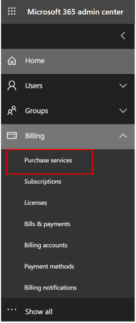
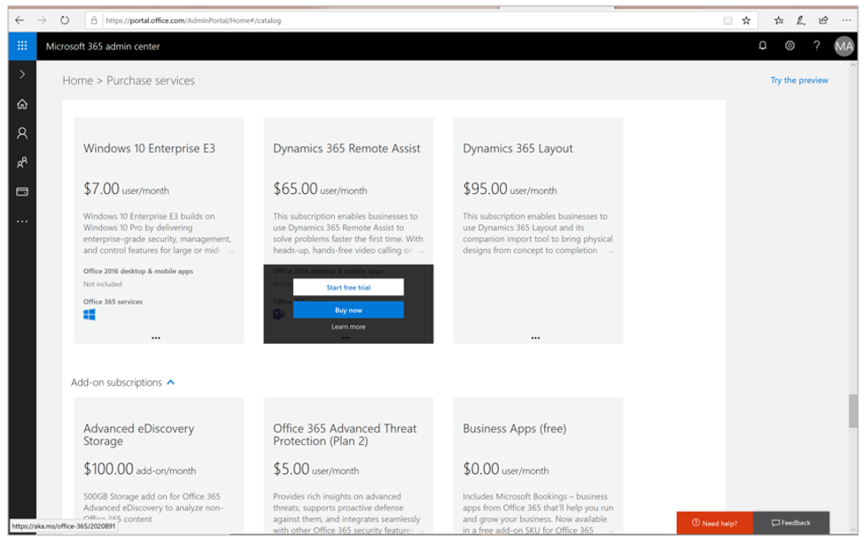

# Free trial for Dynamics 365 Remote Assist

You can try Microsoft Dynamics 365 Remote Assist for free on your HoloLens, HoloLens 2, and mobile phones and tablets. There are three types of free trials. 

|Trial type|Designed for|
|---------------------------|-----------------------------------|
|License-free 90-day trial|*Individuals* that want to quickly try the app|
|30-day Dynamics 365 Remote Assist trial|*Organizations* that want to provide licenses for up to 25 users|
|30-day Dynamics 365 Remote Assist Attach license|*Dynamics 365 Field Service customers* who want to integrate Dynamics 365 Field Service with Dynamics 365 Remote Assist (provides licenses for up to 25 users)|

  > [!NOTE]
  > The 30-day Dynamics 365 Remote Assist and Dynamics 365 Remote Assist Attach licenses include Microsoft Teams licenses. [Learn how to set up Microsoft Teams for your organization](https://docs.microsoft.com/dynamics365/mixed-reality/remote-assist/use-microsoft-teams-with-remote-assist). 

In this article, we’ll walk through the three ways you can get a Dynamics 365 Remote Assist trial. 

## Option 1: License-free 90-day trial for individuals

### Prerequisites

   - A [Microsoft account](https://account.microsoft.com/account) (required to use the Microsoft Teams freemium account). Note that a Microsoft account cannot be used with the Dynamics 365 Remote Assist trial license options. It can only be used for the license-free 90-day trial when combined with Microsoft Teams freemium. 

   - A [Microsoft Teams freemium account](https://products.office.com/microsoft-teams/free).

   - Azure Active Directory [Premium Trial](https://azure.microsoft.com/trial/get-started-active-directory/) (for HoloLens users only). Users will sign in to their accounts through Azure Active Directory. 

   - A HoloLens, HoloLens 2, or a mobile device. [Learn about additional licensing and product requirements](./requirements.md).

With the license-free 90-day free trial, each user must download Dynamics 365 Remote Assist from the appropriate app store to start the trial. 

This trial grants access only to the client application. Additional Dynamics 365 Remote Assist functionality through the Dynamics 365 Remote Assist solution (asset capture, one-time calling, calls dashboard) is not included and requires additional licensing.

### Steps for HoloLens and HoloLens 2

1.	Go to the **Start** menu, and then select **Microsoft Store**. 

2.	Search for and download **Dynamics 365 Remote Assist** and launch the app.

3.	Sign into Dynamics 365 Remote Assist with your Microsoft Teams account. 

4.	The app will prompt you to start your free trial of Dynamics 365 Remote Assist. Select **Continue**. You will then be taken to your **Contacts** page.  

5.	You can now use Dynamics 365 Remote Assist on your HoloLens and HoloLens 2.  

### Steps for mobile
1.	If you’re using a mobile device, go to the appropriate iOS or Android app store.

2.	Search for and download **Dynamics 365 Remote Assist** and launch the app.

3.	Sign into Dynamics 365 Remote Assist with your Microsoft Teams account. 

4.	The app will prompt you to start your free trial of Dynamics 365 Remote Assist. Select **Continue**. You will then be taken to your **Contacts** page. 
 
5.	You can now use Dynamics 365 Remote Assist on your mobile device. [Learn how to make calls to a remote expert on Microsoft Teams (desktop and mobile)](mobile-app/making-calls-with-ar.md).

## Option 2: 30-day Dynamics 365 Remote Assist trial license for organizations

### Prerequisites

- Your organization must have a Microsoft 365 or Microsoft 365 [administrator account](https://www.microsoft.com/microsoft-365/business/office-365-administration). [Learn more about admin permissions](/office365/admin/admin-overview/admin-overview?view=o365-worldwide). 

Admins must acquire a 30-day Dynamics 365 Remote Assist trial license (for up to 25 seats in an organization) through the Microsoft 365 or Microsoft 365 administrator portal. 

1.	[Log into the Microsoft 365 or Office 365 Administrator Portal](https://www.microsoft.com/microsoft-365/business/office-365-administration) using your organization’s admin account.

    

2. Make sure the **Try the new admin center** toggle is turned off.

3.	In the left navigation bar, select **Billing > Purchase Services**. 

    

4.	A list of services will appear. Scroll down until you find **Dynamics 365 Remote Assist**.

5.	Hover your cursor over the plan until two options appear: **Start free trial** or **Buy now**. Select **Start free trial**. Follow the next steps of the payment process. 
    

## Option 3: Dynamics 365 Remote Assist Attach trial license (for Dynamics 365 Field Service customers)

Dynamics 365 Remote Assist is integrated with Dynamics 365 Field Service to help users solve problems on-site. Admins must acquire the 30-day Dynamics 365 Remote Assist Attach trial license (for up to 25 seats in an organization) through the Microsoft 365 or Microsoft 365 administrator portal. 

1.	[Log into the Microsoft 365 or Office 365 Administrator Portal](https://www.microsoft.com/microsoft-365/business/office-365-administration) using your organization’s admin account.
 
2.	Make sure the **Try the new admin center** toggle is turned off.
  
3.	In the left navigation bar, select **Billing** > **Purchase Services**. 
 
4.	A list of services will appear. Scroll down until you see **Dynamics 365 Remote Assist Attach**.

5.	Hover your cursor over the plan until two options will appear: **Start free trial** or **Buy now**. Select **Start free trial**. Follow the next steps of the payment process. 

## Next steps
- [Buy Dynamics 365 Remote Assist licenses for HoloLens and Mobile](buy-remote-assist.md). 
- [Deploy Dynamics 365 Remote Assist licenses to individuals in your organization](deploy-remote-assist.md). 

[!INCLUDE[footer-include](../includes/footer-banner.md)]
