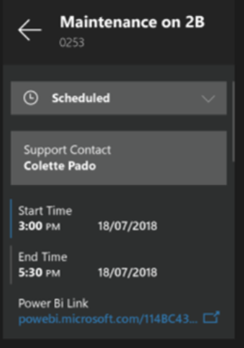
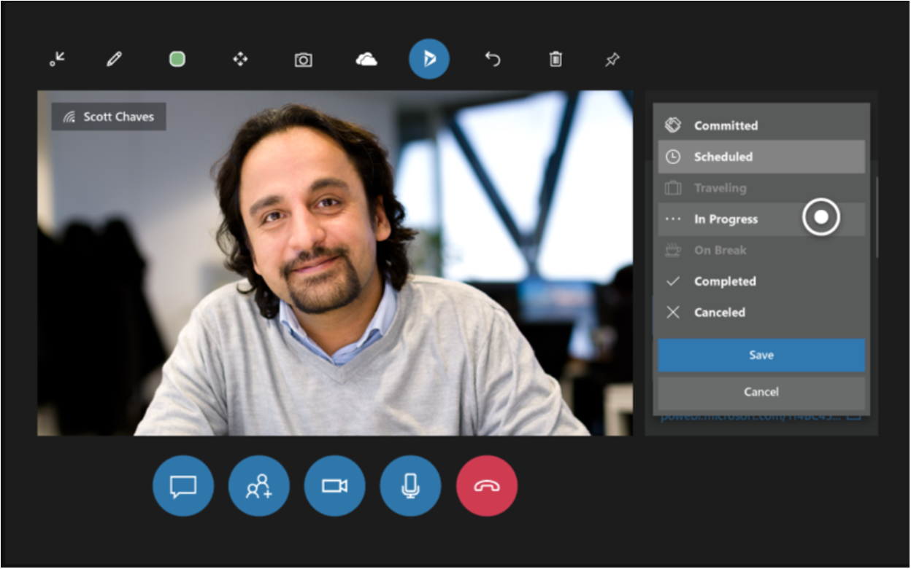

# Update a Dynamics 365 Field Service booking on HoloLens

Empower technicians to solve problems faster by pairing Dynamics 365 Remote Assist HoloLens application with the Dynamics 365 Field Service application. This allows technicians to:
* Call the expert assigned to the booking
* Automatically attach their call log to the Field Service work order that their booking is associated with
* Save snapshots to their booking so technicians and inspectors can more seamlessly document their work

###
With the Dynamics 365 Field Service application, technicians manage their assigned work orders, or the service work needed, and perform maintenance and inspections onsite at customer locations. With Dynamics 365 Remote Assist Mobile, technicians and inspectors can directly post essential call data and history to their Field Service work orders without opening their work order. 

If your organization uses Dynamics 365 Field Service to manage field service work orders and bookings and has [set up Dynamics 365 integration](https://github.com/MicrosoftDocs/dynamics-365-mixed-reality-pr/edit/toc-sandbox/mr-docs/remote-assist/mobile-app/field-service-integration.md), you can view Dynamics 365 Field Service bookings from Dynamics 365 Remote Assist and call the collaborator listed in the Resource field. This enables you to do heads-up, hands-free calling through HoloLens in the context of a Dynamics 365 Field Service booking, and snapshots from the call to the booking.  

### View a Dynamics 365 Field Service booking and call an assigned resource:

1.  In the Contacts menu, select **[!include[pn-dyn-365](../includes/pn-dyn-365.md)]**  to open the **Booking** pane. (Select **[!include[pn-dyn-365](../includes/pn-dyn-365.md)]**  again to close the **Booking** pane.)  
      
    The **Recent Contacts** screen will appear with a **Booking** pane to the
    right.
    
    
    
    > [!NOTE]
    > Only bookings with the “In Progress” status are listed. When a booking is open, any Remote Assist call you make will be associated with that booking, even if you do not collaborate with the resource listed.
    
1.  Now, you will see booking details, including the Work Order ID and Support contact. 

           

If you'd like to call the Support Contact, select their name. Then, in the filtered contacts list, select the tile for the expert. If you don’t see the contact you’re looking for, select **Search** to bring up the holographic keyboard.  
      
    
### View and update booking details during a call

During a call, you may want to view booking details, such as the start and end time of the booking, the resource assigned to the booking, and a Power BI link to relevant data. To view the booking, select Dynamics (or say, “Remote Assist, Dynamics”). 
Booking information is blurred out when you’re in a video call, but remains visible during an audio-only call.

You may update your booking status.

### Open a Power BI dashboard from a Dynamics 365 Field Service booking

-   Select a [!include[pn-power-bi](../includes/pn-power-bi.md)] link to open [!include[pn-power-bi](../includes/pn-power-bi.md)] Online in a browser or to open the
    [!include[pn-power-bi](../includes/pn-power-bi.md)] desktop application.
    
    > [!NOTE]
    > When you open a [!include[pn-power-bi](../includes/pn-power-bi.md)] dashboard, [!include[pn-dyn-365-remote-assist](../includes/pn-dyn-365-remote-assist.md)] closes. If you’re on a call with an expert, the expert will remain on the call. To return to Remote Assist, navigate to the Start menu and select the Remote Assist tile. 
    

### Modify the default booking view

To modify the default view of information in the **Booking** pane, [edit the view as
you would any Dynamics 365 view](https://docs.microsoft.com/dynamics365/customer-engagement/customize/create-and-edit-views).

