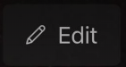
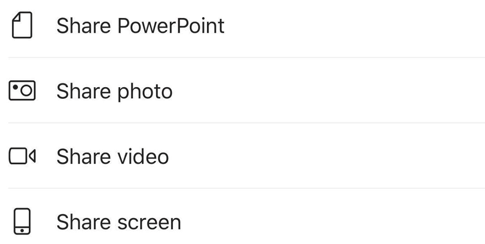

# Overview 

Dynamics 365 Remote Assist for HoloLens 1, HoloLens 2, mobile, and tablets enables technicians to connect and collaborate with a remote collaborators who use  Microsoft Teams on PC and mobile. Using live video calling and mixed reality annotations, they can troubleshoot problems together, faster.

Remote collaborators who use Teams on mobile or tablet can collaborate with Remote Assist users on-the-go. When you use Teams on mobile (Android or iOS), you can collaborate in one-to-one calls and Teams meetings with one collaborator who is using Remote Assist on HoloLens 1 or 2 (a “Remote Assist HoloLens user”). You can also collaborate with one collaborator who is using Remote Assist on mobile user (a “Remote Assist mobile user”). Learn the network requirements for a call here.
However, the features you can use to collaborate differ depending on whether you are collaborating with a Remote Assist HoloLens user or Remote Assist mobile user, and whether you’re using an ad hoc one-to-one call or a Teams meeting. 

**Teams mobile features when collaborating with a Remote Assist HoloLens vs Remote Assist mobile user**

# Features available for Teams mobile user in a one-to-one call or meeting with a Remote Assist HoloLens user

 Feature |  Available for Teams mobile user in a one-to-one call or a meeting with one Remote Assist HoloLens user | Available for Teams mobile user in a one-to-one call with a Remote Assist mobile user 
---| ---| ---
Make outgoing call | Yes | Yes, but Remote Assist mobile user must have Remote Assist app open to be notified of the call 
Receive incoming call | Yes| Yes
Join and schedule a Teams meeting | Yes | Np
Control outgoing video, outgoing audio, and incoming audio  | Yes | Yes
Annotate Remote Assist user’s environment using arrows and ink  | Yes | Yes
Annotate 2D snapshot using arrows and ink | Yes | Yes
Send a text message | Yes |Yes
Share files from OneDrive | For a one-to-one call, yes if using Insert File feature; for a meeting, yes if using the Share feature | No
Share photos from device | For a one-to-one call, yes if using Insert File feature; for a meeting, yes if using the Share feature | No
Record call | Only during Teams meeting, not during one-to-one call | No
Share screen | Yes | No

## Make outgoing call

Launch Teams and select Calls.

  

Under History, you will see your recent contacts. Select one of the contacts to call them. 

> [!NOTE]
>  If you are in a call with a Remote Assist HoloLens user and want to record the call, please schedule a Teams meeting with that user. 

## Schedule a Teams meeting

To schedule a meeting, navigate to the calendar tab. You will see a list of upcoming meetings. 

Then, select [icon] in the top right corner and fill in the details for a new meeting.

## Join a Teams meeting

To join a meeting, navigate to the calendar tab. You will see a list of upcoming meetings.  

Select “Join” to join a meeting.  

  

> [!NOTE]
>  When the Remote Assist HoloLens user logs into Remote Assist and views their recent contacts, they will see a meeting notification and “Join Meeting” button if the meeting begins within 15 minutes or is currently ongoing. They will see this notification even if they did not accept the Teams meeting via Outlook or Teams. 

> [!NOTE]
> When you join a Teams meeting, the Remote Assist HoloLens user will not receive a call, and vice versa. You must both join the meeting to participate in the meeting. 

## Use call controls

Call controls are found at the bottom of the screen. 
* [icon] Toggle the video icon to control outgoing video
*	[icon] Toggle the microphone to control outgoing audio
*	[icon] Select the speaker button to control incoming audio

To use additional features, select the […]. 
Regardless of whether you’re in a 1:1 call or a meeting with a Remote Assist HoloLens user, you can use features including:
*	Put the call on hold
*	Use dial pad
*	Toggle incoming video
*	Share your screen – your screen will pop up as a video in the Remote Assist HoloLens user’s world [add link]
*	Start video with blur (iOS only) is useful if you have sensitive information behind you or want to protect the privacy of colleagues who are behind you. 
However, some additional features are specific to a one-to-one call or a meeting. 
*	In a 1:1 call, select “Insert file” to display a file - from OneDrive, a file from Teams, or an image stored on your mobile device - in the Remote Assist HoloLens user’s environment. The HoloLens user can save files shared this way to their OneDrive. Both you and the Remote Assist user can view the files via Teams chat after the call ends. (You will notice that in a meeting, the call controls do not display an “Insert File” option. However, you can still display a file in the Remote Assist HoloLens user’s environment by using the “Share” feature). See more [add link to “Insert OneDrive file”]
*	In a meeting, select “Start recording” to record a Teams meeting with a Remote Assist HoloLens user. (A 1:1 call between Teams mobile and Remote Assist HoloLens cannot be recorded.) See more [add link to “record your meeting”]

> [!NOTE]
> Turn your phone horizonal to see more of the Remote Assist HoloLens user’s environment.   

## Annotate Remote Assist user’s environment using arrows and ink   

When you are in a call with a Remote Assist user, you will see their real world environment and holograms. 

To add an annotation, select 

Then, you will see the mixed reality toolbar. 

* To add arrows, select Place arrow [] . tap where you would like to place the arrow. To control the direction of the arrow, tap, hold, and draw a circle with your finger until it is at the correct direction. Then release.
* To add ink, select Ink   
* To change the arrow or ink color, select Color Picker   .
* To undo the most recent annotation you added, select [undo]
* To delete every annotation you’ve added, select the [trash] icon and then select “Delete All Notes”
* To delete only the annotations you added since the most recent time you entered Edit mode, select the [trash] icon and then select “Clear Current Notes” It does not clear the annotations your collaborator added.

When you’re done adding annotations, press [check icon] to resume the live video feed. All the annotations you and will persist even after you stopped editing. 

> [!NOTE]
> Each collaborator can only delete their own annotations.

## Send a text message

Press the [icon] to open the text chat to send text messages. After the call, all participants can access the messages (and OneDrive and Teams file links) via the Teams chat, not Remote Assist chat.

> [!NOTE]
> You may notice that you can attach a photo, gif, or file via the text message. This is not the best way to share a file. We recommend sharing OneDrive file using this method [add link to “Share photos stored in OneDrive”] and sharing a photo from your device using this method [add link to “Share photos from your device”].

## Display OneDrive files

**Display and share link to OneDrive file during a 1:1 call**

Navigate to call controls and select […]. Then select Insert Files and select whether to insert file from OneDrive or from Teams teams and channels.   
When you insert an image, still gif, video, or PDF from OneDrive for Business or a Teams channel, it will show up as a new slate in the Remote Assist HoloLens user’s environment and a link to the file will be available in the Teams chat even after the call ends. (Note that a link to the file will not appear in the Remote Assist chat.) 
The Remote Assist HoloLens user can save a file to their OneDrive by tapping the OneDrive icon in the top right of the slate. The OneDrive file is then automatically saved to a folder called “HoloLens Received Files.”   

**Display OneDrive file during a meeting**

You may notice that there is no “Insert file” option when you are in a meeting with a Remote Assist HoloLens user. 
To display a OneDrive or Teams file as a new slate in the Remote Assist HoloLens user’s environment, navigate to the call controls, select […], select “Share” and then “Share screen.” 

The Remote Assist HoloLens user will then see a live video of your entire screen both in and outside the Teams mobile app. Navigate to the OneDrive file to display it to your collaborator.   
Because you are sharing your screen, a link to the OneDrive or Teams file is not shared in Teams chat for all collaborators to access after the call ends. To enable your collaborator to access the file after the call, consider granting the collaborator permissions to view the file and then send the link via Teams chat.

## Share files stored on your device

**Display and share link to on-device photo during a 1:1 call**
Navigate to call controls and select […]. Then select Insert Files and select Photo. Then select Photos and take a photo or select a photo from your mobile device’s photo gallery. Next, select the text chat. You will see that the photo is attached to a blank message, but has not been send yet. Send the photo.

The photo will show up as a new slate in the Remote Assist HoloLens user’s environment and a link to the file will be available in the Teams chat even after the call ends. (Note that a link to the file will not appear in the Remote Assist chat.) 
The Remote Assist HoloLens user can save a file to their OneDrive by tapping the OneDrive icon in the top right of the slate. The OneDrive file is then automatically saved to a folder called “HoloLens Received Files.”   

**Display on-device file during a meeting**

You may notice that there is no “Insert file” option when you are in a meeting with a Remote Assist HoloLens user. However, there are several screen sharing options. 

To display an on-device photo or video as a new slate in the Remote Assist HoloLens user’s environment, navigate to the call controls, select […], select “Share” and then “Share photo” or “Share video.” This pulls up a photo or video in your app that you will be displayed as a new slate in the Remote Assist HoloLens user’s environment. Note that because you are specifically sharing that photo or video, if you leave the Teams mobile app, the Remote Assist HoloLens user will no longer see the photo or video. 
To display an on-device file as a new slate in the Remote Assist HoloLens user’s environment, navigate to the call controls, select […], select “Share” and then “Share screen.” The Remote Assist HoloLens user will then see a live video of your screen both in and outside the Teams mobile app (including phone UI). Then, navigate to the OneDrive file and it will be displayed in the HoloLens user’s environment.  
Because you are sharing your screen, a link to the OneDrive or Teams file is not shared in Teams chat for all collaborators to access after the call ends. To enable your collaborator to access the file after the call, consider granting the collaborator permissions to view the file and then send the link via Teams chat.

## Record the Teams meeting

You may want to record a call to document how you resolved an issue or to verify that an inspection was completed correctly. Today, you can only record a Teams meeting with a Remote Assist HoloLens user, not a one-to-one call. 
Navigate to the call controls, select […], then select Start Recording. 
There are two ways to end the recording. You can navigate to the call controls, select […], then select End Recording. Additionally, the recording will automatically end if you leave the call. However, the recording will not automatically end if the Remote Assist HoloLens user ends the call.
After the call ends and the recording is automatically uploaded to Stream, you will receive an email, and both meeting participants will receive a Teams chat notification that the video has been uploaded to Stream. Only call participants will have access to the Stream video. To edit access to the Stream video, please follow instructions [here](https://docs.microsoft.com/en-us/stream/portal-edit-video).

## Share your screen 

**Share your screen in a one-to-one call**

To share your screen, navigate to call controls, select […], select Share, then select Start Broadcast.

After a few seconds, a live view of your screen will be displayed as a new slate in the Remote Assist HoloLens user’s environment. 

**Share your screen in a meeting**

You have more options for sharing your screen in a meeting. Navigate to call controls and select […]. Then, select one of the following: Share photo, Share video, Share screen. (Share powerpoint is not supported today). 

Share... | If you want to...
------------ | -------------
A photo | Take a photo to share or choose one from your gallery
Live video | Share live video from your camera
Your screen | Show your entire screen (within and outside the Teams app)

