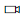
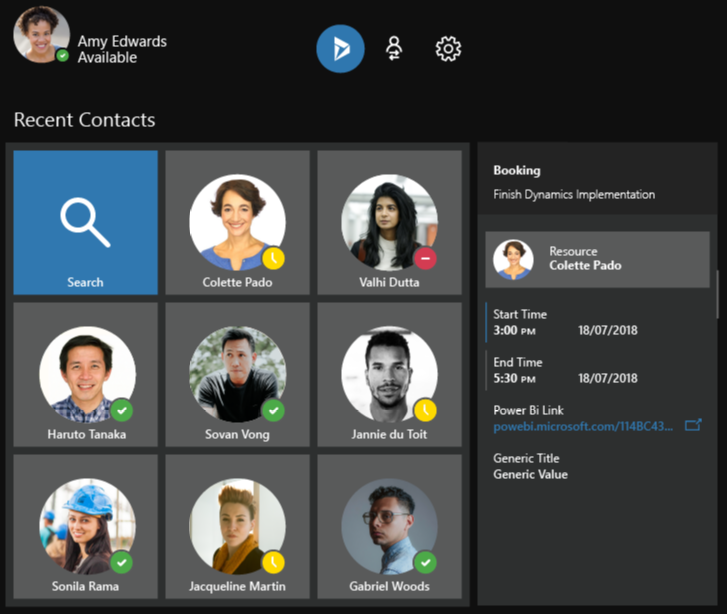
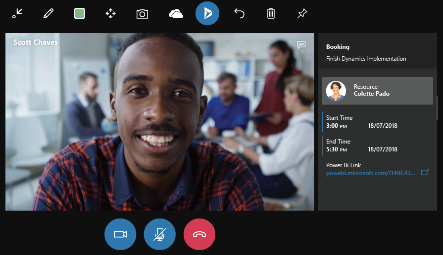

# Dynamics 365 Remote Assist User Guide

Use Microsoft Dynamics 365 Remote Assist to connect and collaborate using
hands-free video calling, mixed reality annotation, and file (image and PDF)
sharing. Use your HoloLens to call an expert who's using Microsoft Teams, and
then share what you see on HoloLens to solve problems and complete tasks
together, faster.

Need more help? [Check out Remote Assist FAQ](faq.md) for answers to common questions.

[Watch how-to videos](videos.md) about Remote Assist.

## What you’ll need

-   A subscription to Remote Assist. If you’re the admin for your organization,
    [learn how to buy and deploy Remote Assist](../licensing/buy-and-deploy.md).

-   A [HoloLens running the Windows 10 April 2018
    Update](https://support.microsoft.com/en-us/help/12643).

-   A work or school account with an [Office 365
    Business](https://products.office.com/en-us/business/office) Premium or
    Essentials subscription.

-   A contact using the latest version of [Microsoft
    Teams](https://products.office.com/en-us/microsoft-teams/group-chat-software) on
    a PC running Windows 10 to make a video call. Learn about using Teams with
    Remote Assist.

-   To connect to Dynamics 365 for Field Service from within Remote Assist,
    you’ll need a [Dynamics 365 license](https://dynamics.microsoft.com/en-us/field-service/overview/?&OCID=AID720979_SEM_yeaT05hp&lnkd=Bing_D365_Brand).

-   An Internet connection. At least 1.5 MB of bandwidth is recommended for the
    best experience.

Need to get up to speed on HoloLens? [Get help](https://support.microsoft.com/products/hololens).

## Install the Remote Assist app

How you install Remote Assist depends on how your administrator chooses to
distribute the app. Your admin might have you install the app from the Microsoft
Store for Consumers, from your organization’s private store, through an email
link, or another method.

### Install the application through the Microsoft Store for Consumers

> [!NOTE]
> The General Availability version of Dynamics 365 Remote Assist will not be available in the Microsoft Store until October 1, 2018.

1.  On your HoloLens, go to **Start**  \> **Microsoft Store** , and then search for “Remote Assist.”

    > [!TIP]
    > On your HoloLens right now? Get Remote Assist.

1.  On your HoloLens, go to **Start**  \> **All apps**. Select **Remote Assist**, then select again to launch the app. Remote Assist is an immersive app with a [holographic view](https://support.microsoft.com/en-us/help/12635), so it will be the only app you see while you’re using it.

If your HoloLens is running the April 2018 Update and you're signed in with an
Azure Active Directory (AAD) account, you'll automatically be signed in to
Remote Assist. If not, use the holographic keyboard to sign in with a work or
school account that has an Office 365 Premium or Essentials subscription. Once
you’re signed in, you’ll see your recent contacts.

## Using the user interface or voice commands

The procedures in this user guide describe how to do tasks through the user
interface or by using voice commands, when available. To use a voice command,
say “Remote Assist,” and then say the voice command. Learn more about voice
commands.

## Make and receive calls

### Make a video call to a contact using Microsoft Teams

-   Open the app and [select](https://support.microsoft.com/en-us/help/12644) a
    recent contact. If you don’t see the contact you want, select **Search** , and then use the holographic keyboard to enter a name or email address.

When your contact answers the call in Microsoft Teams, they’ll be able to see
what you see in your space—including holograms.

> [!NOTE]
> Dynamic audio adjusts the volume level based on ambient noise in the
room so you can hear even if you're working in a loud environment.

### Receive a video call from a contact using Microsoft Teams

-   Select **Video**  (or say “Video”) to accept the call as a video call or **Audio**  (or say “Audio”) to accept it as a voice-only call. To decline the call, select **Ignore** (or say “Ignore”).

> [!NOTE]
> To receive calls when you’re using other apps on HoloLens, open the
Remote Assist app. Then use the [bloom gesture](https://support.microsoft.com/en-us/help/12644/hololens-use-gestures)
to leave Remote Assist. Go ahead and use other apps. You’ll get a notification
from Cortana if a Remote Assist call comes in, and you’ll be able to accept or
decline it using your voice.

### Position the call window

You can pin your video feed in your space, or you can have it follow you around.

To pin your video feed:

-   Gaze to position the window, and then select **Pin**  (or say “Pin”). To have it follow you again, select **Unpin**  (or say “Unpin”).

### Text chat

You can text chat with the other user on the call. The chat window displays just
the text messages sent during the call.

To open the chat window and enter a message:

1.  Select Show  (or say “Show”).

2.  Select the text preview field at the bottom of the chat window. This will
    bring up the holographic keyboard.

3.  Do one of the following:

    -   Select characters in the holographic keyboard.

    -   Select **Microphone** , and then dictate your message. HoloLens will convert the message into text.

    -   Connect a Bluetooth keyboard directly to the HoloLens and type your message.

1.  Select **Send**.

To read previous messages in the chat window:

-   Air tap and drag the chat window.

> [!NOTE]
> If a message is sent from another user when the chat window isn’t
open, you’ll receive a notification.

## Collaborate and annotate

Once you’re connected to a video call, your contact will see everything you see
in your space—including your holograms.

Use [HoloLens gestures](https://support.microsoft.com/en-us/help/12644) to draw,
place arrows, and add files to your space. Your contact will see your additions,
and will be able to make annotations of their own.

### Add an arrow

1.  Select the **Arrow** tool (or say “Arrow”) during a video call.

2.  Gaze where you want to add the arrow, and then air tap to place it.

3.  If you want to specify the direction that the arrow points, air tap and
    hold, and then rotate your hand to position the arrow.

### Draw in your space

1.  Select the **Ink** tool (or say “Ink”) during a video call.

2.  Gaze where you want to draw, and then use tap and hold to draw.

3.  To finish a drawing, raise your finger back up.

### Change arrow or ink color

-   Select **Colors** (or say “Choose colors”), and then choose the one you
    want.

### Add an image or PDF file

Import an image or PDF file from OneDrive for Business and then place it in your
space. For example, add an image of a diagram to assist with the call. The
people you call will be able to see the image or PDF file in the Teams app
during a video call.

To add a file:

1.  During a video call, select **OneDrive**  (or say “OneDrive”).

2.  Find and select the file you want to add.

To move an image:

1.  Gaze at it, and then select **Move** (or say “Move”).

2.  Tap and hold the image and move your hand to reposition it.

To resize an image:

1.  Gaze at it, and then select **Scale** (or say “Scale”).

2.  Tap and hold a corner of the image, and then move your hand to make it
    bigger or smaller.

To navigate in a PDF file:

| **To**                        | **Do this**                                                                                       |
|-------------------------------|---------------------------------------------------------------------------------------------------|
| Go through pages sequentially | Use the arrow keys                                                                                |
| Jump to a specific page       | Select the page number to bring up the holographic number pad, and then select the page you want. |

### Take a snapshot of your annotations

During a call, you can take a photo of your mixed reality annotations to save
for later.

To take a snapshot:

-   Select **Camera**  (or say “Camera”), and then air tap (or say “Snap”) to take the photo.

>   The photo will be saved to your HoloLens camera roll.

## Make changes

To erase all the arrows and drawings you’ve added during a video call:

-   Select **Erase all** at the top of the call window (or say “Erase all”).

To undo your most recent action, including **Erase all**:

-   Select **Undo** at the top of the call window (or say “Undo”).

## Use voice commands

In many cases, you can use voice commands instead of gestures. Some voice
commands are contextual, so they only work in particular areas of the user
interface.

To use a voice command:

-   Say “Remote Assist,” and then say one of the voice commands in the following
    table.

**Note:** You can also gaze at any button and say “Select” to select that
button.

| **Voice command**            | **Description**                                                                      |
|------------------------------|--------------------------------------------------------------------------------------|
| **General**                  |                                                                                      |
| Sign out                     | Sign out of Remote Assist.                                                           |
| Up                           | Go up.                                                                               |
| Previous                     | Go to previous page.                                                                 |
| Next                         | Go to next menu.                                                                     |
| Back                         | Go to previous menu.                                                                 |
| Undo                         | Undo the previous action.                                                            |
| **Pin and unpin video feed** |                                                                                      |
| Pin                          | Pin the video feed in your space so it doesn’t follow you around.                    |
| Unpin                        | Unpin the video feed in your space so it follows you around.                         |
| **Call management**          |                                                                                      |
| Call                         | Call a contact.                                                                      |
| Hang up                      | End the call.                                                                        |
| Audio                        | Answer an incoming call with audio only.                                             |
| Video                        | Answer an incoming call with video.                                                  |
| Ignore                       | Decline an incoming call.                                                            |
| Start video                  | Turn on the video for a call.                                                        |
| Stop video                   | Turn off the video in a call.                                                        |
| Mute                         | Mute the call audio.                                                                 |
| Unmute                       | Unmute the call audio.                                                               |
| Search                       | If used in the Contacts window, brings up the Search window to search for a contact. |
| Next                         | If used in the Contacts window, brings up the next contact in the list.              |
| Previous                     | If used in the Contacts window, brings up the previous contact in the list.          |
| Show                         | Show the text chat window.                                                           |
| Hide                         | Hide the text chat window.                                                           |
| **Annotations**              |                                                                                      |
| Arrow                        | Select the **Arrow** tool to place an arrow in your space.                           |
| Ink                          | Select the **Ink** tool to draw on the walls and surfaces of your space.             |
| Move                         | Select the **Move** tool to move an object.                                          |
| Scale                        | Select the **Scale** tool to resize an object.                                       |
| Camera                       | Select the **Camera** tool to take a picture of your space.                          |
| Snap                         | Take a picture when the Camera tool is open.                                         |
| Colors                       | Pick a color.                                                                        |
| Blue                         | Pick the blue color.                                                                 |
| Gray                         | Pick the gray color.                                                                 |
| Green                        | Pick the green color.                                                                |
| Red                          | Pick the red color.                                                                  |
| Yellow                       | Pick the yellow color.                                                               |
| Erase all                    | Remove all visual elements from your space.                                          |
| **OneDrive**                 |                                                                                      |
| OneDrive                     | Open OneDrive at the root folder to insert a file.                                   |
| Close                        | Close OneDrive.                                                                      |
| Next                         | Go to next page in OneDrive.                                                         |
| Previous                     | Go to previous page in OneDrive.                                                     |
| **Other**                    |                                                                                      |
| Settings                     | Go to Settings page.                                                                 |

## Use Remote Assist to get help in another HoloLens app

Having trouble in another HoloLens app? Use Remote Assist to show an expert
what’s happening and get some help.

Here’s how:

1.  Open an app on your HoloLens.

2.  Use the [bloom gesture](https://support.microsoft.com/en-us/help/12644/hololens-use-gestures)
    to leave the 3D view, but don’t close the app launcher.

3.  Start Remote Assist and call your contact.

4.  Once the video call is connected, use the bloom gesture to leave Remote
    Assist. Your call will remain connected.

5.  Select the live cube of the app you need help with. Once the app has
    launched, your contact will be able to see its content and give you
    guidance.

> [!NOTE]
> When you’re done getting help from your contact, make sure to go back to Remote Assist and disconnect the call. Until you do that, the call will stay connected and your contact will see and hear what’s happening on your HoloLens.

## Use Dynamics 365 for Field Service from Remote Assist

If your organization uses Dynamics 365 for Field Service to manage field service
work orders, you (the first-line worker) can view Dynamics 365 for Field Service
bookings from Remote Assist and call the expert listed in the Resource field.
This enables you to do heads-up, hands-free calling through HoloLens in the
context of a Dynamics 365 Field Service booking.

> [!NOTE]
> A Dynamics 365 license is required to view Field Service bookings.

### View a Field Service booking and call an expert from Remote Assist

1.  In the Contacts menu, select **Dynamics 365**  to open the **Booking** pane. (Select **Dynamics 365**  again to close the **Booking** pane.)  
      
    The **Recent Contacts** screen will appear with a **Booking** pane to the
    right.
    
    > [!NOTE]
    > Only bookings with the “In Progress” status are listed.
    
1.  In the **Booking** pane, select the resource (expert). 

    

1.  In the filtered contacts list, select the tile for the expert. If you don’t
    see the contact you’re looking for, select **Search** to bring up the
    holographic keyboard.  
      
    When you select a contact, you’ll see the following screen. 

    
    
    > [!NOTE]
    > Booking information is blurred out when you’re in a video call, but remains visible during an audio-only call.

### Open a Power BI dashboard from a Field Service booking

-   Select a Power BI link to open Power BI Online in a browser or to open the
    Power BI desktop application.
    
    > [!NOTE]
    > When you open a Power BI dashboard, Remote Assist closes. If you’re on a call with an expert, the expert will remain on the call. Return to Remote Assist by opening the application again through the applications menu or live cube.

### Modify the default booking view

To modify the default view of information in the Booking pane, [edit the view as
you would any Dynamics 365 view](https://docs.microsoft.com/en-us/dynamics365/customer-engagement/customize/create-and-edit-views).

### See also
[Set up and use Microsoft Teams with Remote Assist](use-microsoft-teams-with-remote-assist.md) 
[How-to videos](videos.md) 
[FAQ](faq.md) 
