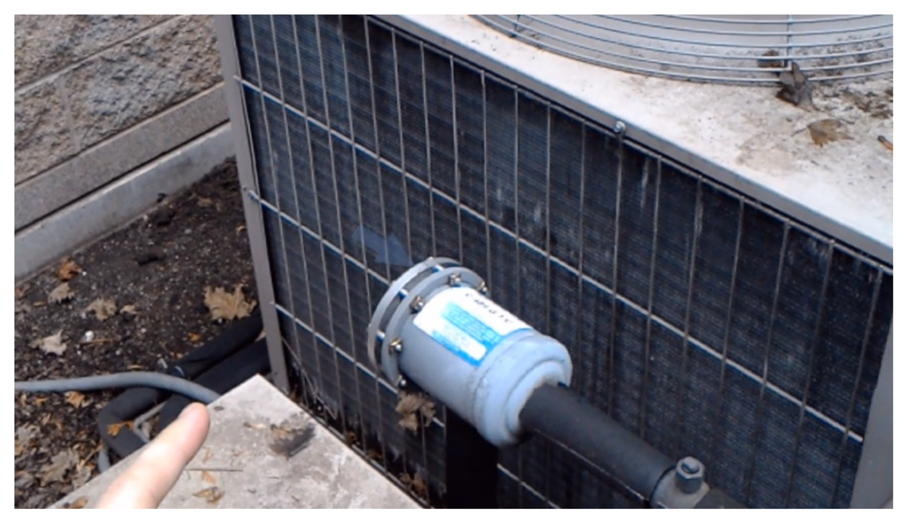
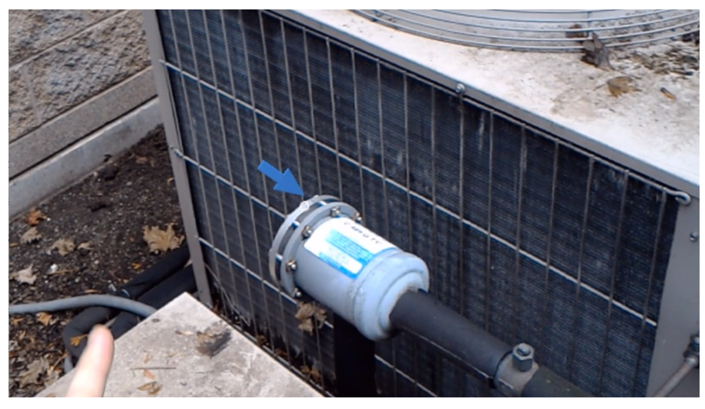
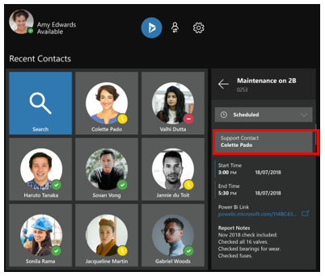
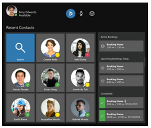
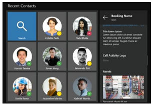

# Dynamics 365 Remote Assist User Guide

Use [!include[pn-dyn-365-remote-assist](../includes/pn-dyn-365-remote-assist.md)] to connect and collaborate using
hands-free video calling, mixed reality annotations, and file (image and PDF)
sharing. Use your [!include[pn-hololens](../includes/pn-hololens.md)] to call an expert who's using [!include[cc-microsoft](../includes/cc-microsoft.md)] [!include[pn-teams](../includes/pn-teams.md)], and
then share what you see on [!include[pn-hololens](../includes/pn-hololens.md)] to solve problems and complete tasks
together, faster.

Need more help? [Check out Remote Assist FAQ](faq.md) for answers to common questions.

[Watch how-to videos](https://go.microsoft.com/fwlink/p/?linkid=2021485) about [!include[pn-remote-assist](../includes/pn-remote-assist.md)].

## What you’ll need

-   A subscription to Remote Assist. Microsoft Teams is included in the Remote Assist subscription for individuals using a Remote Assist license on HoloLens. A Microsoft Teams license is also required for individuals (experts) who communicate with a Remote Assist user on HoloLens. Teams may be available [as a free download](https://teams.microsoft.com/downloads) for these users. If you’re the admin for your organization, [learn how to try or buy, and deploy Remote Assist](../licensing/buy-and-deploy.md). 

-   A [HoloLens running the Windows 10 April 2018
    Update](https://support.microsoft.com/en-us/help/12643).

-   A contact using the latest version of [Microsoft
    Teams](https://products.office.com/en-us/microsoft-teams/group-chat-software) on
    a PC running [!include[pn-ms-windows-short](../includes/pn-ms-windows-short.md)] 10 to make a video call. [Learn about using Teams with
    Remote Assist.](use-microsoft-teams-with-remote-assist.md)

-   To connect to [!include[pn-dyn-365-field-service](../includes/pn-dyn-365-field-service.md)] from within [!include[pn-remote-assist](../includes/pn-remote-assist.md)],
    you’ll need a [Dynamics 365 license](https://dynamics.microsoft.com/en-us/field-service/overview/?&OCID=AID720979_SEM_yeaT05hp&lnkd=Bing_D365_Brand).

-   An internet connection. At least 1.5 MB of bandwidth is recommended for the
    best experience.

Need to get up to speed on [!include[pn-hololens](../includes/pn-hololens.md)]? [Get help](https://support.microsoft.com/products/hololens).

## Install the Remote Assist app

How you install [!include[pn-remote-assist](../includes/pn-remote-assist.md)] depends on how your administrator chooses to
distribute the app. Your admin might have you [install the app from the Microsoft
Store for Consumers](https://www.microsoft.com/store/apps/9P77QGW10K9M), from your organization’s private store, through an email
link, or another method.

### Install the application through the Microsoft Store for Consumers

1.  On your [!include[pn-hololens](../includes/pn-hololens.md)], go to **Start**  \> **[!include[cc-microsoft](../includes/cc-microsoft.md)] Store** ] Store](media/2ac602b5a7855d312f3e7d924732acca.png "Microsoft Store"), and then search for “[!include[pn-remote-assist](../includes/pn-remote-assist.md)].”

2.  On your [!include[pn-hololens](../includes/pn-hololens.md)], go to **Start**  \> **All apps**. Select **[!include[pn-remote-assist](../includes/pn-remote-assist.md)]**, then select it again to launch the app. [!include[pn-remote-assist](../includes/pn-remote-assist.md)] is an immersive app with a [holographic view](https://support.microsoft.com/en-us/help/12635), so it will be the only app you see while you’re using it.

If your [!include[pn-hololens](../includes/pn-hololens.md)] is running the April 2018 Update and you're signed in with an
[!include[pn-azure-active-directory](../includes/pn-azure-active-directory.md)] ([!include[pn-azure](../includes/pn-azure.md)] AD) account, you'll automatically be signed in to
[!include[pn-remote-assist](../includes/pn-remote-assist.md)]. If not, use the holographic keyboard to sign in with a work or
school account that has an [!include[pn-office-365](../includes/pn-office-365.md)] Premium or Essentials subscription. Once
you’re signed in, you’ll see your recent contacts.

## Using the user interface or voice commands

The procedures in this user guide describe how to do tasks through the user
interface or by using voice commands, when available. To use a voice command,
say “[!include[pn-remote-assist](../includes/pn-remote-assist.md)],” and then say the voice command. [Learn more about voice
commands.](#use-voice-commands)

## Make and receive calls

### Make a video call to a contact using Microsoft Teams

-   Open the app and [select](https://support.microsoft.com/en-us/help/12644) a
    recent contact. If you don’t see the contact you want, select **Search** , and then use the holographic keyboard to enter a name or email address.

When your contact answers the call in [!include[cc-microsoft](../includes/cc-microsoft.md)] [!include[pn-teams](../includes/pn-teams.md)], they’ll be able to see
what you see in your space—including holograms.

> [!NOTE]
> Dynamic audio adjusts the volume level based on ambient noise in the
room so you can hear even if you're working in a loud environment.

### Receive a video call from a contact using Microsoft Teams

-   Select **Video**  (or say “Video”) to accept the call as a video call or **Audio**  (or say “Audio”) to accept it as a voice-only call. To decline the call, select **Ignore** (or say “Ignore”).

> [!NOTE]
> To receive calls when you’re using other apps on [!include[pn-hololens](../includes/pn-hololens.md)], open the
[!include[pn-remote-assist](../includes/pn-remote-assist.md)] app. Then use the [bloom gesture](https://support.microsoft.com/en-us/help/12644/hololens-use-gestures)
to leave [!include[pn-remote-assist](../includes/pn-remote-assist.md)]. Go ahead and use other apps. You’ll get a notification
from [!include[pn-cortana](../includes/pn-cortana.md)] if a [!include[pn-remote-assist](../includes/pn-remote-assist.md)] call comes in, and you’ll be able to accept or
decline it using your voice.

### Position the call window

You can pin your video feed in your space, or you can have it follow you around.

To pin your video feed:

-   Gaze to position the window, and then select **Pin**  (or say “Pin”). To have it follow you again, select **Unpin**  (or say “Unpin”).

### Record a call

You can record and save a call to a file for viewing later. The easiest way to do this is to use the Game bar built into all Windows 10 PCs.

To record a call:

1. On a Windows 10 desktop PC, join a call using Microsoft Teams.

2. Press **Windows logo key  + G** to open the Game bar.

   

3. Select the **Start Recording** button (or press **Windows logo key  + Alt + R**).

   A small recording menu will appear that shows that the recording is in progress.
   
   
   
4. To stop recording, select the **Stop Recording** button.

   The video of the recording will appear in your Videos/Captures folder.
   
[Learn more about the Game bar.](https://support.xbox.com/xbox-on-windows/social/record-game-clips-game-bar-windows-10)

### Text chat

You can text chat with the other user on the call. The chat window displays just
the text messages sent during the call.

To open the chat window and enter a message:

1.  Select Show  (or say “Show”).

2.  Select the text preview field at the bottom of the chat window. This will
    bring up the holographic keyboard.

3.  Do one of the following:

    -   Select characters in the holographic keyboard.

    -   Select **Microphone** , and then dictate your message. [!include[pn-hololens](../includes/pn-hololens.md)] will convert the message into text.

    -   Connect a Bluetooth keyboard directly to the [!include[pn-hololens](../includes/pn-hololens.md)] and type your message.

1.  Select **Send**.

To read previous messages in the chat window:

-   Air tap and drag the chat window.

> [!NOTE]
> If a message is sent from another user when the chat window isn’t
open, you’ll receive a notification.

## Screen-sharing with an expert on Microsoft Teams

When you're working with an expert on a call, the expert can share their desktop or application window with you to assist with the call. When an expert shares their desktop or running application this way, your video feed of the expert will change to a solid color. You'll still be able to use all the tools in the toolbar even though your video feed is no longer displayed.

To move, size, or close the shared window, use the controls at the top right of the shared window.

## Collaborate and annotate

Once you’re connected to a video call, your contact will see everything you see
in your space—including your holograms.

Use [HoloLens gestures](https://support.microsoft.com/en-us/help/12644) to draw,
place arrows, and add files to your space. Your contact will see your additions,
and will be able to make annotations of their own.

### Add an arrow

1.  Select the **Arrow** tool (or say “Arrow”) during a video call.

2.  Gaze where you want to add the arrow. You'll see a silhouette of the arrow that shows where it will be placed. For example, note the faint arrow in the following screenshot:

    

3.  Air tap to place the arrow.

    

> [!NOTE]
> If you want to specify the direction that the arrow points, air tap and
    hold, and then rotate your hand to position the arrow.

### Draw in your space

1.  Select the **Ink** tool (or say “Ink”) during a video call.

2.  Gaze where you want to draw, and then use tap and hold to draw.

3.  To finish a drawing, raise your finger back up.

### Change arrow or ink color

-   Select **Colors** (or say “Choose colors”), and then choose the one you
    want.

### Add an image or PDF file

Import an image or PDF file from [!include[pn-onedrive-for-business](../includes/pn-onedrive-for-business.md)] and then place it in your
space. For example, add an image of a diagram to assist with the call. The
people you call will be able to see the image or PDF file in the [!include[pn-teams](../includes/pn-teams.md)] app
during a video call.

To add a file:

1.  During a video call, select **[!include[pn-onedrive](../includes/pn-onedrive.md)]**  (or say “OneDrive”).

2.  Find and select the file you want to add.

To move an image:

1.  Gaze at it, and then select **Move** (or say “Move”).

2.  Tap and hold the image and move your hand to reposition it.

To resize an image:

1.  Gaze at it, and then select **Scale** (or say “Scale”).

2.  Tap and hold a corner of the image, and then move your hand to make it
    bigger or smaller.

To navigate in a PDF file:

| **To**                        | **Do this**                                                                                       |
|-------------------------------|---------------------------------------------------------------------------------------------------|
| Go through pages sequentially | Use the arrow keys                                                                                |
| Jump to a specific page       | Select the page number to bring up the holographic number pad, and then select the page you want. |

### Take a snapshot of your annotations

During a call, you can take a photo of your mixed reality annotations to save
for later.

To take a snapshot:

-   Select **Camera**  (or say “Camera”), and then air tap (or say “Snap”) to take the photo.

>   The photo will be saved to your [!include[pn-hololens](../includes/pn-hololens.md)] camera roll.

## Make changes

To erase all the arrows and drawings you’ve added during a video call:

-   Select **Erase all** at the top of the call window (or say “Erase all”).

To undo your most recent action, including **Erase all**:

-   Select **Undo** at the top of the call window (or say “Undo”).

## Use voice commands and gaze

In many cases, you can use voice commands and gaze instead of gestures. Some voice
commands are contextual, so they only work in particular areas of the user
interface.

> [!IMPORTANT]
> To use a voice command, say “[!include[pn-remote-assist](../includes/pn-remote-assist.md)],” and then say one of the voice commands in the following table. For example, say "Remote Assist, Move" to enter Move mode for a slate (window). You can also gaze at any button and say “Remote Assist, Select” to select that button.

| **Voice command**            | **Description**                                                                      |
|------------------------------|--------------------------------------------------------------------------------------|
| **General**                  |                                                                                      |
| Sign out                     | Sign out of [!include[pn-remote-assist](../includes/pn-remote-assist.md)].           |
| Up                           | Go up.                                                                               |
| Previous                     | Go to previous page.                                                                 |
| Next                         | Go to next menu.                                                                     |
| Back                         | Go to previous menu.                                                                 |
| Undo                         | Undo the previous action.                                                            |
| **Pin and unpin video feed** |                                                                                      |
| Pin                          | Pin the video feed in your space so it doesn’t follow you around.                    |
| Unpin                        | Unpin the video feed in your space so it follows you around.                         |
| **Call management**          |                                                                                      |
| Call                         | Call a contact.                                                                      |
| Hang up                      | End the call.                                                                        |
| Audio                        | Answer an incoming call with audio only.                                             |
| Video                        | Answer an incoming call with video.                                                  |
| Ignore                       | Decline an incoming call.                                                            |
| Start video                  | Turn on the video for a call.                                                        |
| Stop video                   | Turn off the video in a call.                                                        |
| Mute                         | Mute the call audio.                                                                 |
| Unmute                       | Unmute the call audio.                                                               |
| Search                       | If used in the Contacts window, brings up the Search window to search for a contact. |
| Next                         | If used in the Contacts window, brings up the next contact in the list.              |
| Previous                     | If used in the Contacts window, brings up the previous contact in the list.          |
| Show                         | Show the text chat window.                                                           |
| Hide                         | Hide the text chat window.                                                           |
| **Annotations**              |                                                                                      |
| Arrow                        | Select the **Arrow** tool to place an arrow in your space.                           |
| Ink                          | Select the **Ink** tool to draw on the walls and surfaces of your space.             |
| Move                         | Select the **Move** tool to move an object.                                          |
| Scale                        | Select the **Scale** tool to resize an object.                                       |
| Camera                       | Select the **Camera** tool to take a picture of your space.                          |
| Snap                         | Take a picture when the Camera tool is open.                                         |
| Colors                       | Pick a color.                                                                        |
| Blue                         | Pick the blue color.                                                                 |
| Gray                         | Pick the gray color.                                                                 |
| Green                        | Pick the green color.                                                                |
| Red                          | Pick the red color.                                                                  |
| Yellow                       | Pick the yellow color.                                                               |
| Erase all                    | Remove all visual elements from your space.                                          |
| **Slate (window) management**        |                                                                                      |
| Move                         | Enter Move mode. |
| Select slate                 | After entering Move mode, gaze at the slate you want to move, and then say "Select slate". The slate will start following your gaze.
| Accept                       | After entering Move mode and selecting a slate, place the slate where you are currently gazing by saying "Accept".                                          | 
| Cancel                       | Stops a currently selected slate from following your gaze and returns it to its original position before you started moving it. |
| Scale                        | Enter Scale mode to resize the slate.   Or, you can gaze to select the Scale tool, and then say "Select" to enter Scale mode.                                                                     |
| Bigger or Smaller            | Make the window bigger or smaller after entering Scale mode. Repeat the "Bigger" or "Smaller" command until the window is the size you want.                          |
| Reset                        | While gazing at a slate that has recently been moved, saying "Reset" will return the slate to its original position.          |
| **[!include[pn-onedrive](../includes/pn-onedrive.md)]**                 |                                                                                      |
| [!include[pn-onedrive](../includes/pn-onedrive.md)]                     | Open [!include[pn-onedrive](../includes/pn-onedrive.md)] at the root folder to insert a file.                                   |
| Close                        | Close [!include[pn-onedrive](../includes/pn-onedrive.md)].                                                                      |
| Next                         | Go to next page in [!include[pn-onedrive](../includes/pn-onedrive.md)].                                                         |
| Previous                     | Go to previous page in [!include[pn-onedrive](../includes/pn-onedrive.md)].                                                     |
| **Other**                    |                                                                                      |
| Settings                     | Go to Settings page.                                                                 |

## Use the Narrator to announce incoming calls

You can turn on the Narrator if you want to take advantage of voice narration for incoming calls. When you turn on incoming call narration, in addition to displaying the incoming caller's name, the caller's name is announced. You can then say "video," "audio," or "ignore" to respond to the incoming call.

To turn on the Narrator for incoming calls:

- Go to Settings, and then select the **On** button for the Narrator.

  

## Use Remote Assist to get help in another HoloLens app

Having trouble in another [!include[pn-hololens](../includes/pn-hololens.md)] app? Use [!include[pn-remote-assist](../includes/pn-remote-assist.md)] to show an expert
what’s happening and get some help.

Here’s how:

1.  Open an app on your [!include[pn-hololens](../includes/pn-hololens.md)].

2.  Use the [bloom gesture](https://support.microsoft.com/en-us/help/12644/hololens-use-gestures)
    to leave the 3D view, but don’t close the app launcher.

3.  Start [!include[pn-remote-assist](../includes/pn-remote-assist.md)] and call your contact.

4.  Once the video call is connected, use the bloom gesture to leave [!include[pn-remote-assist](../includes/pn-remote-assist.md)]. Your call will remain connected.

5.  Select the live cube of the app you need help with. Once the app has
    launched, your contact will be able to see its content and give you
    guidance.

> [!NOTE]
> When you’re done getting help from your contact, make sure to go back to [!include[pn-remote-assist](../includes/pn-remote-assist.md)] and disconnect the call. Until you do that, the call will stay connected and your contact will see and hear what’s happening on your [!include[pn-hololens](../includes/pn-hololens.md)].

## Use Dynamics 365 for Field Service from Remote Assist

If your organization uses [Dynamics 365 for Field Service](https://dynamics.microsoft.com/en-us/field-service/overview/?&OCID=AID720979_SEM_yeaT05hp&lnkd=Bing_D365_Brand) to manage field service
work orders, you (the first-line worker) can view [!include[pn-dyn-365-field-service](../includes/pn-dyn-365-field-service.md)]
bookings from [!include[pn-remote-assist](../includes/pn-remote-assist.md)] and call the expert listed in the **Support Contact** field.
This enables you to do heads-up, hands-free calling through [!include[pn-hololens](../includes/pn-hololens.md)] in the
context of a [!include[pn-dyn-365-field-service](../includes/pn-dyn-365-field-service.md)] booking.

> [!NOTE]
> For information on setting up and troubleshooting [!include[pn-field-service](../includes/pn-field-service.md)] integration if you're an admin, see [Troubleshoot Field Service integration](troubleshoot-field-service.md). **Note** that [a Dynamics 365 license](https://dynamics.microsoft.com/en-us/field-service/overview/?&OCID=AID720979_SEM_yeaT05hp&lnkd=Bing_D365_Brand) is required to view [!include[pn-field-service](../includes/pn-field-service.md)] bookings from [!include[pn-remote-assist](../includes/pn-remote-assist.md)].

### View a Field Service booking and call an expert from Remote Assist

1.  In the Contacts menu, select **[!include[pn-dyn-365](../includes/pn-dyn-365.md)]**  to open the **Booking** pane. (Select **[!include[pn-dyn-365](../includes/pn-dyn-365.md)]**  again to close the **Booking** pane.)  
      
    The **Recent Contacts** screen will appear with a Booking pane to the
    right. The Booking pane shows all the bookings for the current day, organized by active, upcoming, and completed bookings.    
    
    ")
    
    > [!NOTE]
    > Only bookings for the current day are listed.
    
2.  Select the booking you want to view under **Active Bookings** or **Upcoming Bookings Today**. 

3.  In the **Booking** pane, select the resource (expert) listed under **Support Contact**.

    

3.  In the filtered contacts list, select the tile for the expert. If you don’t
    see the contact you’re looking for, select **Search** to bring up the
    holographic keyboard.  
      
    When you select a contact, you’ll see the following screen. 

    
    
    > [!NOTE]
    > Booking information is blurred out when you’re in a video call, but remains visible during an audio-only call.
    
### Change the status of a booking

1. In the Booking pane for an open booking, select a booking under **Active Bookings** or **Upcoming Bookings Today**. 

   
   
   > [!NOTE] 
   > You can't change the status of a completed booking.   

2. Open the drop-down list next to the current status, and then select the appropriate status. 

   

### Save call information or a mixed reality image to a booking

At the end of the call, Remote Assist call information is automatically saved to the selected booking as long as you haven't selected the Back button or refreshed the Dynamics 365 pane. The same is true for mixed-reality images that you capture.

To capture a mixed-reality image:

1.  Select the Camera button.

2.  In the pop-up that appears, select whether you want to save the image to OneDrive or to the booking.

    
    
    If you save the image to the booking, it will appear under **Assets** in the Booking pane.
    
    

### Open a Power BI dashboard from a Field Service booking

-   Select a [!include[pn-power-bi](../includes/pn-power-bi.md)] link to open [!include[pn-power-bi](../includes/pn-power-bi.md)] Online in a browser or to open the
    [!include[pn-power-bi](../includes/pn-power-bi.md)] desktop application.
    
    > [!NOTE]
    > When you open a [!include[pn-power-bi](../includes/pn-power-bi.md)] dashboard, [!include[pn-remote-assist](../includes/pn-remote-assist.md)] closes. If you’re on a call with an expert, the expert will remain on the call. Return to [!include[pn-remote-assist](../includes/pn-remote-assist.md)] by opening the application again through the applications menu or live cube.

### Modify the default booking view

To modify the default view of information in the **Booking** pane, [edit the view as
you would any Dynamics 365 view](https://docs.microsoft.com/en-us/dynamics365/customer-engagement/customize/create-and-edit-views).

### See also
[Set up and use Microsoft Teams with Remote Assist](use-microsoft-teams-with-remote-assist.md) 
[How-to videos](https://go.microsoft.com/fwlink/p/?linkid=2021485) 
[FAQ](faq.md) 
