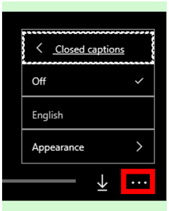

# How-to videos for Dynamics 365 Remote Assist

Watch these short videos to get up and running with Microsoft [!include[pn-dyn-365-remote-assist](../includes/pn-dyn-365-remote-assist.md)].

Looking for more help? Check out our [User Guide](user-guide.md).

> [!TIP]
> To turn on closed-captions for videos, select the **More options** (...) button, select **Closed captions**, and then select **English**.   Dynamics 365 Remote Assist is not available in languages other than English at this time.

## Remote Assist for HoloLens

<iframe src="https://www.microsoft.com/en-us/videoplayer/embed/RE2F6TI" frameborder="0" allowfullscreen=""></iframe>

 

<iframe src="https://www.microsoft.com/en-us/videoplayer/embed/RE2FeDU" frameborder="0" allowfullscreen=""></iframe>

 

<iframe src="https://www.microsoft.com/en-us/videoplayer/embed/RE2F6TH" frameborder="0" allowfullscreen=""></iframe>

 

<iframe src="https://www.microsoft.com/en-us/videoplayer/embed/RE2F4dM" frameborder="0" allowfullscreen=""></iframe>

 

<iframe src="https://www.microsoft.com/en-us/videoplayer/embed/RE2F9qy" frameborder="0" allowfullscreen=""></iframe>

 

<iframe src="https://www.microsoft.com/en-us/videoplayer/embed/RE2F9qs" frameborder="0" allowfullscreen=""></iframe>

 

<iframe src="https://www.microsoft.com/en-us/videoplayer/embed/RE2FNci" frameborder="0" allowfullscreen=""></iframe>

 

<iframe src="https://www.microsoft.com/en-us/videoplayer/embed/RE2F6TG" frameborder="0" allowfullscreen=""></iframe>

 

<iframe src="https://www.microsoft.com/en-us/videoplayer/embed/RE2FhfT" frameborder="0" allowfullscreen=""></iframe>

## Microsoft Teams and Remote Assist

<iframe src="https://www.microsoft.com/en-us/videoplayer/embed/RE2F6TF" frameborder="0" allowfullscreen=""></iframe>

 

<iframe src="https://www.microsoft.com/en-us/videoplayer/embed/RE2F6TK" frameborder="0" allowfullscreen=""></iframe>

 

<iframe src="https://www.microsoft.com/en-us/videoplayer/embed/RE2F6TP" frameborder="0" allowfullscreen=""></iframe>

 

<iframe src="https://www.microsoft.com/en-us/videoplayer/embed/RE2F6TJ" frameborder="0" allowfullscreen=""></iframe>

## See also
[User Guide](user-guide.md) 
[Use Teams with Remote Assist](use-microsoft-teams-with-remote-assist.md) 
[FAQ](faq.md)
