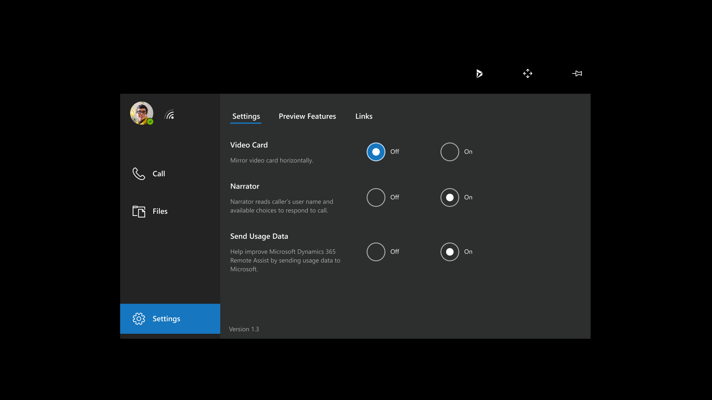

# Voice commands and gestures for Dynamics 365 Remote Assist on HoloLens

## Voice commands

You can navigate Dynamics 365 Remote Assist on HoloLens and HoloLens 2 using voice commands and gaze instead of gestures. Some voice commands are contextual, so they only work in particular areas of the user interface. For example, “Start inking” only works if the ink tool is already active.” You can also look at any button and say “Select.”

At this time, voice commands and speech recognition are [available in specific languages for Hololens](./faq-hololens.md#what-languages-are-voice-commands-and-speech-recognition-available-for).

When you’re in a call, a good way to learn the features of Dynamics 365 Remote Assist is to say, “Remote Assist.” The app will display what it believes you said by showing a check mark and “Remote assist.” Then, the app will display the name of each button, as you see in the image above. After a few seconds, these labels will automatically disappear. 

When you’re outside a call (for example, before you’ve picked up, or when you’re looking at list of contacts but have not called anyone), you can also say “Remote Assist” to remind yourself of the voice command for each button you see. The labels will pop up for a few seconds, and then disappear. However, you will not receive confirmation of your voice command. 
For full list of voice commands, see the list below.

> [!Note]
> To use a voice command, say “Remote Assist,” and then say one of the voice commands in the following table. For example, say "Remote Assist, Move" to enter Move mode for a slate (window). You can also gaze at any button and say “Remote Assist, Select” to select that button.

|Voice command|Description |
| ------------- | -----|
|**General**| | 
|Start listening (stop listening)       |Put Dynamics 365 Remote Assist into (out of) state expecting a list of commands to follow                  |
|Settings                               | Switch to Settings tab                                                                     |
|Sign out                               | Sub menu available from the user's avatar picture, sign out                                                                                 |
|**Call management**  | | 
|Call                                   |Call a contact                                                                                                     |
|Video                                  | Answer an incoming call with video.                                                                               |
|Audio                                  | Answer an incoming call with audio only.                                                                          |
|Ignore                                 |Decline a ringing incoming call.                                                                                   |
|Hang up                                |End a ringing outgoing call.                                                                                       |
|Hang up                                | End the call.                                                                                                     |
|Mute (unmute)                          |Mute (unmute) the audio of a Dynamics 365 Remote Assist call                                                                    |
|Start (stop) recording |Start (stop) recording a one-to-one call with one Teams desktop user                                                                                 |
|Camera / capture                       | Selects the camera/capture tool                               |
|Open participants (close participants) |Open (close) the participants panel                                                                                |
|Start Video (stop video)               | Turn on (turn off) the video for a Dynamics 365 Remote Assist call.                                                            |
|Join meeting                           |Join Teams meeting                                                                                                 |
|Open participants (close participants) |Open (close) the participants panel                                                                                |
|**Slate (window) management**  | | 
|Pin (unpin)                            |Pin window in your space (unpin window so it follows you)                                                          |
|Scale (scale off)                      |Select (deselect) the Scale tool, letting the user scale objects                                                   |
|Bigger (smaller)                       | When Scale tool is active, make current slate larger (smaller)                                                    |
|Select slate                           | Select the object currently being gazed at, to move or resize.                                                    |
|Accept                                 |Place the object currently being held by "Select slate" command.                                                   |
|Move                                   |Selects the Move tool, letting the user move objects.                                                              |
|Open chat (close chat)                 |Open (close) the Text Chat window when docked to the Video Card.                                                   |
|**Annotations**    | | 
|Arrow (arrow off)                      |Select (deselect) the Arrow tool, letting the user create holographic arrows pointing to parts of their environment. |
|Place arrow                            |Place an arrow at the current gaze cursor location.                                                                |
|Arrow                                  |Enable arrow placement (Deselect arrow tool)                                                                       |
|Ink (ink off)                          |Select (deselect) the Draw tool, letting the user draw on the walls and surfaces of their environment.               |
|Colors                                 |Open color picker to determine color of arrow or ink                                                               |
|Blue / Gray / Green / Red / Yellow      |Make arrow and ink this color                                                                                      |
|Start (stop) inking                    | Begin (stop) placing ink                                                                                          |
|Undo                                   | Undo the previous action.                                                                                         |
|Erase All                              |Remove all annotations you placed                                                                                  |
|**File management**   | | 
|Files                               |Switch to Files tab to insert files into your space                                                                               |
|Home                                   |When Files tab is open, navigate to the root OneDrive folder.                                                 |
|Up                                     |When Files tab is open, select up                                                                                   |
|Back (next)                            |When Files tab is open, go back                                                                                     |
|Previous (next)                        |When viewing a PDF, return to previous page (go to next page)                                                      |
|Set page                               |Open the PDF page-jump UI. Use "Select" to set page numbers.                                                       |
|Reset                                  |Reset the newest received file to its original placement and size.                                                 |
|**Post-call**                               |                                          |
|Post (post all)                               |Post call artifacts to associated work order                                      |
|Discard (discard all)                               |Do not post call artifacts to associated work order                                                             |
|Retry                               |Try posting again                                 |

## Use the Narrator to announce incoming calls

You can turn on the Narrator if you want to take advantage of voice narration for incoming calls. When you turn on incoming call narration, in addition to displaying the incoming caller's name, the caller's name is announced. You can then say "Remote Assist, Video," "Remote Assist, Audio," or "Remote Assist, Ignore," to respond to the incoming call.

To turn on the Narrator for incoming calls:

- Go to Settings, and then select the **On** button for the Narrator.

 

## Gestures

The April 2021 release of Dynamics 365 Remote Assist improved gestures on HoloLens 2 to make them more instinctual:

- Improved audio and visual cues make it easier to grab, move, and resize windows, whether you’re directly manipulating windows up close or manipulating them from a distance with hand rays.

- Improvements to the near finger cursor make it easier to grab windows and select buttons. 

[!INCLUDE[footer-include](../includes/footer-banner.md)]