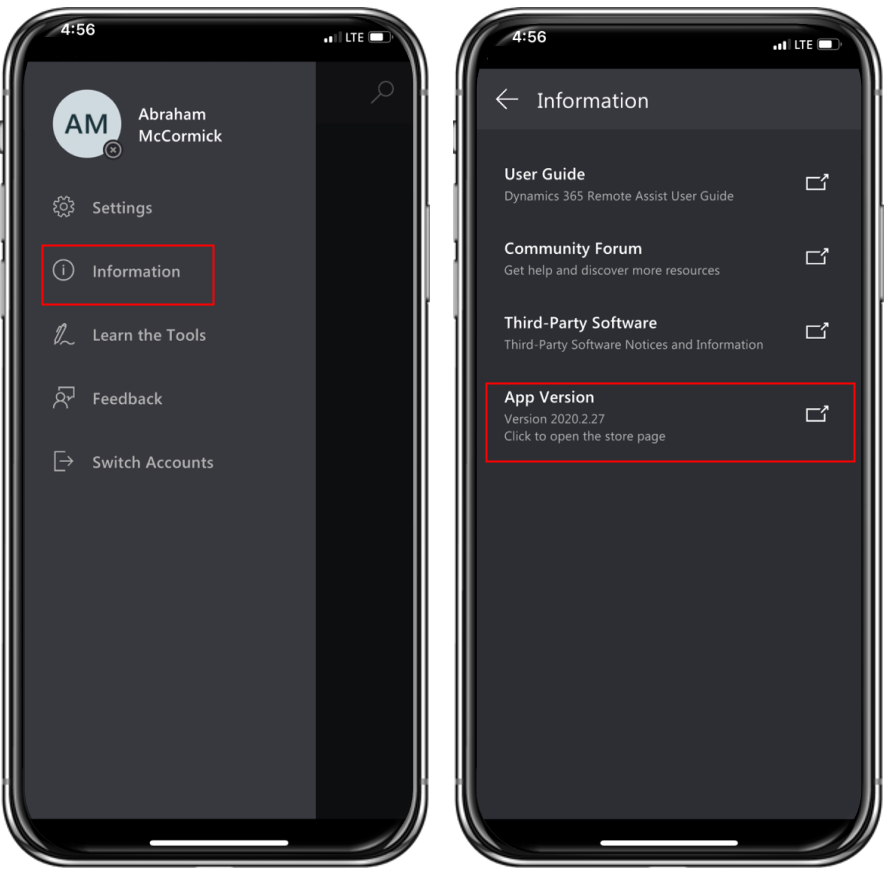

# What's new in Dynamics 365 Remote Assist

This article describes new features for Dynamics 365 Remote Assist.

For more detailed information about new and upcoming features for Dynamics 365 Remote Assist, see [the Dynamics 365 and Power Platform release plans](/dynamics365/release-plans/).

## June 3, 2021

### Version info

|Device|Version|
|------------------------------------------|---------------------------------------------|
|HoloLens 2 app|XXX|
|iOS mobile app|2021.6.1|
|Android mobile app|2021.6.1|

### Bug fixes

**Remote Assist Mobile, quality improvements**

- Fix for sharing files when there is a guest user in the call
- 	One Time Call link should not ask for sign-in due to missing special characters in the URL
- 	Improvements for energy saver mode
- 	Fix for annotations availability when user rejoins One Time Call
- 	Fix for misleading “Annotations Unavailable” message in calls with devices without the augmented reality support
- 	Fix for user presence status that sometimes was not showing correctly
- 	Support for France digital accessibility requirements
- 	Fix for annotations after combing back from on hold
- 	Fix for footer being overlap in the post call screen
- 	Fix for missing recording icon in the participants list
- 	Fix for screen rotation after leaving snapshot mode
- 	Fix for camera and microphone buttons state when connecting to a call
- 	Fix for duplicated assets in the assets capture
- 	Fix for “save to chat” button in a One Time Call
- 	Accessibility and stability improvements

**Remote Assist on Hololens 2, quality improvements**

- 	Fixed issue with Recent Contacts sometimes disappearing unexpectedly
- 	Fixed issue with user not being able to navigate back from Contact search in rare cases
- 	Fixed issues with file sharing (receiving files from other call/meeting participants)
- 	Added voice commands for additional scenarios (saving a photo, navigating through Hints)
- 	Addressed issue causing the windows not to return to the correct position after losing and re-gaining tracking
- 	The pinned state of main window is now being respected when ending the call
- 	Improved handling of menu panels when being manipulated by user (grabbed and moved)
- 	The button states representing active tool (Arrow, Ink) now always reflect the current state
- 	Visual improvements: addressed unexpected flickering of the panels when user was interacting with their edges, fixed images loaded in 3D space appearing 'washed out' when overlaid on top of other panels
- 	Various improvements to data logging, to help investigate issues reported by customers more effectively

## May 7, 2021

### Version info

|Device|Version|
|------------------------------------------|---------------------------------------------|
|HoloLens 2|303.2105.4005|

### Bug fixes

-	Fix for Calls dashboard to improve logging reliability

## April 29, 2021

### Version info

|Device|Version|
|------------------------------------------|---------------------------------------------|
|iOS mobile app|2021.4.3|
|Android mobile app|2021.4.3|

### Bug fixes

-	Fix for one-time-call sessions – for users who weren't able to take and annotate snapshots during sessions.
-	Fix for Bluetooth headset – Dynamics 365 Remote Assist will now properly use the headset microphone. 

## April 1, 2021

> [!IMPORTANT]
> Dynamics 365 Remote Assist on HoloLens (1st gen) has entered Long Term Servicing state. Future updates for HoloLens (1st gen) will focus on issues and security fixes, while maintaining feature parity with the February 2021 release (version 302.2102.2003).

### Version info

|Device|Version|
|------------------------------------------|---------------------------------------------|
|HoloLens 2|303.2103.29002|
|iOS mobile app|2021.4.1|
|Android mobile app|2021.4.1|

### Features

|Feature|How to|
|-----------------------------------------------|----------------------------------------------------|
|Support for low-bandwidth situations|- [HoloLens 2](hololens-low-bandwidth.md)  - [Mobile app](./mobile-app/low-bandwidth-mode.md)|
|Support for meeting recordings on HoloLens|[Record calls in Dynamics 365 Remote Assist on HoloLens](record-calls-hololens.md)|
|Improvement to the Microsoft Dataverse Environment selection||
|Instinctual interaction improvements on HoloLens 2|[HoloLens voice commands and gestures](voice-commands-hololens.md#gestures)|
|Long Term Servicing for Dynamics 365 Remote Assist on HoloLens (1st gen)||

### Bug fixes

#### HoloLens 2

- Fixed date format for Calls Dashboard. 
- Addressed an issue where contact presence wasn't displayed in some instances.
- Fixed a problem with setting permissions for a photo shared from HoloLens in a call chat with guest participants.

#### iOS and Android mobile app

- Fix for posting to work order files that were shared and not visible when in a call with Dynamics 365 Remote Assist users. 
- Fix for video recording on devices that don't support H.265 HEVC. 
- Fix for deleting annotations placed before the recording was started. 
- Fix for annotations when call is in “on hold” state. 
- Fix for losing annotations for the collaborator when technicians are turning off the camera. 
- Fix for missing video recording link from the meeting. 
- Fix for annotations toolbar being disabled in one-time-call and meetings. 
- Fix for dates not being properly localized in the Calls dashboard. 
- Improvement for text chat availability in calls with poor network connections. 
- Improvement for annotation thickness after annotations are placed in close distance. 
- Fix for unnecessary Dynamics error showing up in the app. 
- Fix for video freezing, end-call availability, and blocked annotations on iOS during a call. 

> [!TIP]
> Looking for earlier features? Go to [version history for Dynamics 365 Remote Assist](version-history.md). 

## Locate your version number

### HoloLens

To find which version of Dynamics 365 Remote Assist HoloLens you have, go to **Settings**, and then find the version number in the **About** section.

### Mobile app

To find which version of Dynamics 365 Remote Assist mobile you have, go to the menu and select the **Information** option. You'll see the **App Version** there. See the following screenshot for reference.

> [!div class="mx-imgBorder"]
> 

[!INCLUDE[footer-include](../includes/footer-banner.md)]
